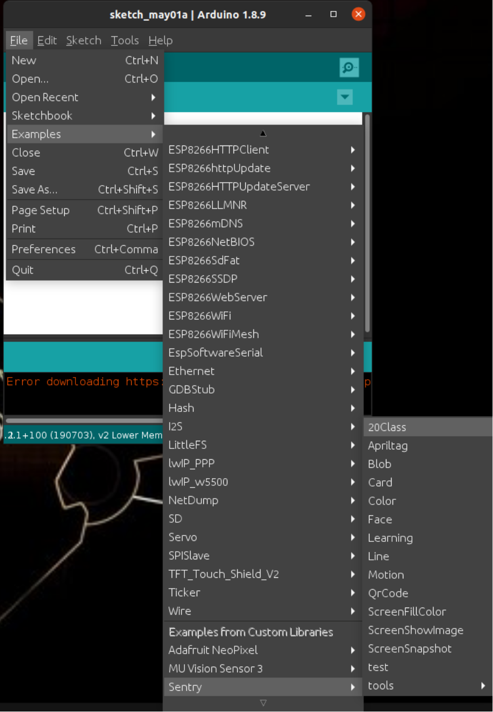

.. _chapter_arduino_index:

Sentry-Arduino 开发文档
=======================

Sentry-Arduino 库是一个专门为 Arduino 系列开发板定制打造的驱动库，适用于 Sentry 全系列产品，
用户可以使用该库迅速上手获取 Sentry 的识别结果，以及设置相关参数。

安装
----

1. `下载 <https://github.com/AITosee/Sentry-Arduino/releases>`_ Sentry ``.zip`` 库。
2. 打开 Arduino IDE ，点击 ``项目->加载库->添加.ZIP库``，选择上一步中下载的 ``.zip`` 文件，点击 ``确定`` 按钮完成库的添加。

    .. image:: images/arduine_add_library.png

快速上手
--------

Arduino 库中提供了丰富的例程，这些例程默认使用了 **I2C 模式**，以下内容均以 I2C 模式作为通讯方式。

1. 接线（详见 ``硬件介绍->接线方式`` 章节）

    如果使用串口模型，请将 Sentry 对应的线接至 Arduino 除 ``Serial`` 外任意串口上。

    +---------+--------+
    | Arduino | Sentry |
    +=========+========+
    |   TX    |   RX   |
    +---------+--------+
    |   RX    |   TX   |
    +---------+--------+

    .. attention::

        Arduino Uno 只有一个硬件串口（用于传输打印信息至电脑端），建议使用软串口与 Sentry 进行通讯。

2. 设置 Sentry 的通讯模式

    - Sentry1 用户可通过将摇杆向下长按 3 秒以上来切换通讯模式，松手后闪烁红色即为串口模式，闪烁绿色即为 I2C 模式，闪烁蓝色即为简单指令模式， 详见： :doc:`../../Sentry1/Hardware/index` ->模式按键 。

        .. image:: images/arduino_sentry1_backword.png
            :width: 300

    - Sentry2 用户可通过将 Sentry2 右上角摇杆向右拨动三次进入硬件配置界面，选中 ``输出模式`` ，按压摇杆，激活右侧选项页面，选择需要的模式，然后点击 ``YES`` 并向左拨动三次摇杆退出设置。

        .. image:: images/sentry_set_uart_mode.png
            :width: 300

3. 烧录例程

    打开 Arduino IDE，依次点击 ``File->Examples->Sentry``，选择对应型号的 Sentry 的任意例程，点击 ``Upload`` 上传程序至 Arduino 主控。

4. 观察现象

    程序烧录完毕后，打开 Arduino IDE 中的 ``Serial Monitor``，识别到算法对应的物体后即会有相应的结果输出。

使用
----

1. 初始化

    Sentry-Arduino 库支持 UART/I2C 两种通讯方式，用户可以通过以下方式初始化 Sentry。

    - UART:

        .. code-block:: cpp
            :linenos:
            :emphasize-lines: 16,17

            #include <Arduino.h>
            #include <Sentry.h>
            #include <SoftwareSerial.h>

            /* 定义 Sentry 型号，此处使用了 Sentry2 作为例子，可替换成其他型号如 Sentry1 等 */
            typedef Sentry2 Sentry;

            /* 实例化 Sentry，创建 Sentry 变量，并指定 Sentry 地址为 0x60 */
            Sentry sentry(0x60);
            /* 实例化软串口，并定义其 TX/RX 引脚 */
            #define TX_PIN 11
            #define RX_PIN 10
            SoftwareSerial mySerial(RX_PIN, TX_PIN);

            void setup() {
                /* 设置软串口波特率与 Sentry 一致 */
                mySerial.begin(9600);
                /* 使用串口初始化 Sentry，若 err 返回为 0，则初始化正常，否则返回对应错误码。 */
                sentry_err_t err = sentry.begin(&mySerial);
            }

        .. attention::

            Arduino 部分型号（如：UNO）只有一个硬件串口，该类主控上建议使用 `软串口 <https://docs.arduino.cc/learn/built-in-libraries/software-serial>`_。
            其他有2个及2个以上硬串口的型号（如：atmega2560，esp32等）也可使用 **除Serial** 以外的硬件串口。

    - I2C

        .. code-block:: cpp
            :linenos:

            #include <Arduino.h>
            #include <Sentry.h>
            #include <Wire.h>

            /* 定义 Sentry 型号，此处使用了 Sentry2 作为例子，可替换成其他型号如 Sentry1 等 */
            typedef Sentry2 Sentry;

            /* 实例化 Sentry，创建 Sentry 变量，并指定 Sentry 地址为 0x60 */
            Sentry sentry(0x60);

            void setup() {
                Wire.begin();
                /* 使用 I2C 初始化 Sentry，若 err 返回为 0，则初始化正常，否则返回对应错误码。 */
                sentry_err_t err = sentry.begin(&Wire);
            }

    .. note::

        1. 若返回非 0 错误，则表示通讯异常，请检查主控代码中的选择通讯模式（UART/I2C）与 Sentry 上的通讯模式是否一致。
        2. 实例化 Sentry 时地址可以设置为任意值，需与 Sentry 设备显示的地址一致，地址默认值为 0x60。

    .. warning::

        同时开启过多算法会导致算法执行速度变慢，响应时间变长，部分内存较小的主控会出现内存不足而导致初始化失败的情况。

2. 开启算法

    .. code-block:: cpp
        :linenos:

        /* 开启卡片检测算法 */
        err = sentry.VisionBegin(Sentry::kVisionCard);

    .. note::

        当前 ``Sentry1`` 支持的算法包括：

        ============    ===========
        颜色识别        kVisionColor
        色块检测        kVisionBlob
        线条检测        kVisionLine
        卡片检测        kVisionCard
        人体检测        kVisionBody
        ============    ===========

        当前 ``Sentry2`` 支持的算法包括：

        ============    ===========
        颜色识别        kVisionColor
        色块检测        kVisionBlob
        AprilTag        kVisionAprilTag
        线条检测        kVisionLine
        深度学习        kVisionLearning
        卡片检测        kVisionCard
        人脸检测        kVisionFace
        20类物体检测    kVision20Classes
        二维码识别      kVisionQrCode
        运动物体        kVisionMotionDetect
        ============    ===========

        算法具体介绍可见： :doc:`../../Sentry2/Vision/index`

3. 获取算法识别结果

    .. code-block:: cpp
        :linenos:

        void loop() {
            unsigned long ts = millis();
            /* 获取算法识别到目标的数量 */
            int obj_num = sentry.GetValue(Sentry::kVisionCard, kStatus);
            unsigned long te = millis();
            if (obj_num) {
                printf("Totally %d objects in %lums:\n", obj_num, te - ts);
                /* 打印算法所有识别到物体的位置和标签 */
                for (int i = 0; i < obj_num; ++i) {
                    int x = sentry.GetValue(Sentry::kVisionCard, kXValue, i);
                    int y = sentry.GetValue(Sentry::kVisionCard, kYValue, i);
                    int w = sentry.GetValue(Sentry::kVisionCard, kWidthValue, i);
                    int h = sentry.GetValue(Sentry::kVisionCard, kHeightValue, i);
                    int l = sentry.GetValue(Sentry::kVisionCard, kLabel, i);
                    printf("  obj[%d]: x=%d,y=%d,w=%d,h=%d, label=%s\n", i, x, y, w, h, l);
                }
            }
        }

    .. tip::

        通过重定向标准输出流到对应的串口，可以在 Arduino 上使用 ``printf`` 向对应串口打印输出字符。
        （该方法当前不支持浮点数打印输出，且会占用更多内存，可能会引起内存不足等问题，不建议在非调试环境下使用）

        .. code-block:: cpp
            :linenos:

            /* 将标准输出流重定向至串口 */
            int serial_putc(char c, struct __file*) {
                Serial.write(c);
                return c;
            }

            void setup() {
                /* 在初始化函数中初始化串口和标准输出流 */
                Serial.begin(9600);
                fdevopen(&serial_putc, 0);
            }

4. 开启 WiFi

    WiFi 的启动与关闭可通过 ``WiFiConfig`` 函数进行控制。

    .. code-block:: cpp
        :linenos:

        sentry.WiFiConfig(true, kWiFiBaud1152000);

5. 截屏

    截屏后可选择将图片保存于 ``SD卡``，或通过 ``USB/UART/WiFi`` 发送至其他设备。

    - `完整例程 <https://github.com/AITosee/Sentry-Arduino/blob/main/examples/ScreenSnapshot/ScreenSnapshot.ino>`_

    .. code-block:: cpp
        :linenos:

        #define SNAPSHOT_TO_SD_CARD false
        #define SNAPSHOT_TO_UART false
        #define SNAPSHOT_TO_USB false
        #define SNAPSHOT_TO_WIFI true
        #define SNAPSHOT_FROM_SCREEN false

        sentry.Snapshot(SNAPSHOT_TO_SD_CARD, SNAPSHOT_TO_UART, SNAPSHOT_TO_USB,
                        SNAPSHOT_TO_WIFI, SNAPSHOT_FROM_SCREEN);

    .. attention::

        想要通过 ``USB/UART/WiFi`` 发送至其他设备前需要手动先开启对应的 ``USB/UART/WiFi`` 设备哦！

例程
----

所有例程在 Arduino 库中 ``examples/`` 文件夹下，可通过点击 Arduino IDE 上方
``文件→例程→Sentry`` 找到对应算法的相关调用例程。

.. note::

    可通过开启或关闭例程中 I2C 和 UART 的相关宏定义来选择串口通讯模式或 I2C 通讯模式：

    .. code-block:: cpp
        :linenos:

        /* 打开 SENTRY_UART 宏，关闭 SENTRY_I2C 即表示为串口通讯模式 */
        // #define SENTRY_I2C
        #define SENTRY_UART

    .. code-block:: cpp
        :linenos:

        /* 打开 SENTRY_I2C 宏，关闭 SENTRY_UART 即表示为 I2C 通讯模式 */
        #define SENTRY_I2C
        // #define SENTRY_UART

API 说明
--------

.. cpp:enum:: sentry_obj_info_e

    算法结果

        .. cpp:enumerator:: kStatus

            检测到目标的数量

        .. cpp:enumerator:: kXValue

            目标的横向坐标

        .. cpp:enumerator:: kYValue

            目标的纵向坐标

        .. cpp:enumerator:: kWidthValue

            目标宽度

        .. cpp:enumerator:: kHeightValue

            目标高度

        .. cpp:enumerator:: kLabel

            目标标签*（类别）

        .. cpp:enumerator:: kRValue

            目标红色通道值

        .. cpp:enumerator:: kGValue

            目标绿色通道值

        .. cpp:enumerator:: kBValue

            目标蓝色通道值

.. cpp:enum:: sentry_camera_zoom_e

    摄像头缩放等级

        .. cpp:enumerator:: kZoomDefault

            默认缩放等级

        .. cpp:enumerator:: kZoom1
        .. cpp:enumerator:: kZoom2
        .. cpp:enumerator:: kZoom3
        .. cpp:enumerator:: kZoom4
        .. cpp:enumerator:: kZoom5

.. cpp:enum:: sentry_camera_fps_e

    摄像头帧率

        .. cpp:enumerator:: kFPSNormal

            摄像头普通帧率（约 25 fps）

        .. cpp:enumerator:: kFPSHigh

            摄像高帧率模式（约 50 fps）

.. cpp:enum:: sentry_camera_white_balance_e

    摄像头白平衡模式

        .. cpp:enumerator:: kAutoWhiteBalance

            摄像头自动白平衡

        .. cpp:enumerator:: kLockWhiteBalance

            摄像头锁定白平衡（将白平衡参数固定在当前数值）

        .. cpp:enumerator:: kWhiteLight

            摄像头白光模式

        .. cpp:enumerator:: kYellowLight

            摄像头黄光模式

.. cpp:enum:: sentry_baudrate_e

    串口波特率

        .. cpp:enumerator:: kBaud9600
        .. cpp:enumerator:: kBaud19200
        .. cpp:enumerator:: kBaud38400
        .. cpp:enumerator:: kBaud57600
        .. cpp:enumerator:: kBaud115200
        .. cpp:enumerator:: kBaud921600
        .. cpp:enumerator:: kBaud1152000
        .. cpp:enumerator:: kBaud2000000

.. cpp:class:: Sentry2

    Sentry2 驱动，支持 I2C/UART 两种通讯方式。

    .. cpp:enum:: sentry_vision_e

        算法类型

            .. cpp:enumerator:: kVisionColor

                颜色识别算法

            .. cpp:enumerator:: kVisionBlob

                颜色检测算法

            .. cpp:enumerator:: kVisionAprilTag

                AprilTag 算法

            .. cpp:enumerator:: kVisionLine

                线条检测算法

            .. cpp:enumerator:: kVisionLearning

                深度学习算法

            .. cpp:enumerator:: kVisionCard

                卡片检测算法

            .. cpp:enumerator:: kVisionFace

                人脸检测算法

            .. cpp:enumerator:: kVision20Classes

                20 类通用物体检测算法

            .. cpp:enumerator:: kVisionQrCode

                二维码检测算法

            .. cpp:enumerator:: kVisionMotionDetect

                移动物体检测算法

    .. cpp:function:: Sentry(uint32_t address = 0x60)

        Sentry 构造函数。

        :param address: Sentry 地址，可选值为 ``0x60,0x61,0x62,0x63``，默认值为 ``0x60``

    .. cpp:function:: uint8_t begin(HwSentryUart::hw_uart_t communication_port)

        使用串口模式初始化 Sentry。

        :param communication_port: 串口号
        :return: 错误码，返回 ``SENTRY_OK``，则初始化成功，其他，则初始化失败

    .. cpp:function:: uint8_t begin(HwSentryI2C::hw_i2c_t* communication_port)

        使用 I2C 模式初始化 Sentry。

        :param communication_port: I2C 端口号
        :return: 错误码，返回 ``SENTRY_OK``，则初始化成功，其他，则初始化失败

    .. cpp:function:: uint8_t VisionBegin(sentry_vision_e vision_type)

        开启对应算法

        :param vision_type: 算法类型
        :return: 错误码，返回 ``SENTRY_OK``，则初始化成功，其他，则开启失败

    .. cpp:function:: uint8_t VisionEnd(sentry_vision_e vision_type)

        关闭对应算法

        :param vision_type: 算法类型
        :return: 错误码，返回 ``SENTRY_OK``，则关闭成功，其他，则关闭失败

    .. cpp:function:: int GetValue(sentry_vision_e vision_type, sentry_obj_info_e obj_info, int obj_id = 0)

        读取对应算法的结果

        :param vision_type: 算法类型
        :param obj_info: 结果类型
        :param obj_id: 结果 ID，默认为 ``0``
        :return: 对应结果的值

    .. cpp:function:: char* GetQrCodeValue()

        读取二维码识别结果

        :return: 二维码识别到的字符串

    .. cpp:function:: uint8_t SetParamNum(sentry_vision_e vision_type, int max_num)

        设置单次检测最大返回结果的数量

        :param vision_type: 算法类型
        :param max_num: 检测结果数量
        :return: 错误码，返回 ``SENTRY_OK``，则设置成功，其他，则设置失败

    .. cpp:function:: uint8_t SetParam(sentry_vision_e vision_type, sentry_object_t* param, int param_id)

        设置检测参数

        :param vision_type: 算法类型
        :param param: 检测结果参数及对应的值
        :param param_id: 参数 ID
        :return: 错误码，返回 ``SENTRY_OK``，则设置成功，其他，则设置失败

    .. cpp:function:: uint8_t CameraSetZoom(sentry_camera_zoom_e zoom)

        设置摄像头缩放等级

        :param zoom: 缩放等级
        :return: 错误码，返回 ``SENTRY_OK``，则设置成功，其他，则设置失败

    .. cpp:function:: uint8_t CameraSetRotate(bool enable)

        设置摄像头图像旋转

        :param enable: ``true``：图像旋转 180°
        :return: 错误码，返回 ``SENTRY_OK``，则设置成功，其他，则设置失败

    .. cpp:function:: uint8_t CameraSetFPS(sentry_camera_fps_e fps)

        设置摄像头帧率

        :param fps: 摄像头帧率
        :return: 错误码，返回 ``SENTRY_OK``，则设置成功，其他，则设置失败

    .. cpp:function:: uint8_t CameraSetAwb(sentry_camera_white_balance_e awb)

        设置摄像头白平衡

        :param awb: 摄像头白平衡模型
        :return: 错误码，返回 ``SENTRY_OK``，则设置成功，其他，则设置失败

    .. cpp:function:: uint8_t UartSetBaudrate(sentry_baudrate_e baud)

        设置串口波特率

        :param baud: 串口波特率
        :return: 错误码，返回 ``SENTRY_OK``，则设置成功，其他，则设置失败

    .. cpp:function:: int rows()

        获取图像实际宽度

        :return: 图像宽度

    .. cpp:function:: int cols()

        获取图像实际高度

        :return: 图像高度

库二次开发教程-以 STM32F103C8T6 为例
------------------------------------

开发环境依赖
++++++++++++

1. 编译工具链需支持 C++11
2. 编译工具链需支持 GNUC++
3. 设备可用内存需 >= 1kb

库结构介绍
++++++++++

::

    ├ src/                          源代码根目录
    │   ├ debug/                    调试文件目录
    │   ├ hardware/                 硬件底层驱动库文件（UART/I2C）
    │   │   ├ hw_sentry_i2c.*       *I2C 硬件驱动文件
    │   │   └ hw_sentry_uart.*      *串口硬件驱动文件
    │   └ protoc/                   串口协议库文件
    └ examples/                     例程目录

串口驱动开发
++++++++++++

串口驱动开发仅需修改 ``src/hardware/hw_sentry_uart.h`` 和 ``src/hardware/hw_sentry_uart.cpp`` 两个驱动文件即可。

- ``src/hardware/hw_sentry_uart.h`` 头文件分析

    .. code-block:: cpp
        :linenos:

        class HwSentryUart {
          ...
          typedef int hw_uart_t;    // 串口类型定义
          ...
          /**
          * @brief 检查串口待接收的数据数量
          * @return 串口缓存内待接收的数据字节数
          */
          virtual size_t available(void);
          /**
          * @brief 读取串口缓存内的数据，若串口缓存内数据数量小于输入 buffer 长度，
          *        则等待直到串口超时
          * @param[out] 外部内存地址
          * @param[in] 外部内存长度
          * @return 读取到的数据的长度
          */
          virtual size_t read(uint8_t* buf, size_t length);
          /**
          * @brief 将数据发送至串口
          * @param[in] 外部内存地址
          * @param[in] 外部内存长度
          * @return 写入数据的长度
          */
          virtual size_t write(uint8_t* buf, size_t length);
          ...
        };

- STM32F103C8T6 串口驱动 ``Serial.c`` 开发

    .. code-block:: cpp
        :linenos:

        #include "stm32f10x.h"
        #include <stdio.h>
        #include <stdarg.h>
        #include "Delay.h"

        uint8_t Serial_RxRingbuffer[128];
        int ring_buffer_front;
        int ring_buffer_back;
        int ring_buffer_size;

        void Serial_Init(void)
        {
            RCC_APB2PeriphClockCmd(RCC_APB2Periph_USART1, ENABLE);
            RCC_APB2PeriphClockCmd(RCC_APB2Periph_GPIOA, ENABLE);

            GPIO_InitTypeDef GPIO_InitStructure;
            GPIO_InitStructure.GPIO_Mode = GPIO_Mode_AF_PP;
            GPIO_InitStructure.GPIO_Pin = GPIO_Pin_9;
            GPIO_InitStructure.GPIO_Speed = GPIO_Speed_50MHz;
            GPIO_Init(GPIOA, &GPIO_InitStructure);

            GPIO_InitStructure.GPIO_Mode = GPIO_Mode_IPU;
            GPIO_InitStructure.GPIO_Pin = GPIO_Pin_10;
            GPIO_InitStructure.GPIO_Speed = GPIO_Speed_50MHz;
            GPIO_Init(GPIOA, &GPIO_InitStructure);

            USART_InitTypeDef USART_InitStructure;
            USART_InitStructure.USART_BaudRate = 9600;
            USART_InitStructure.USART_HardwareFlowControl = USART_HardwareFlowControl_None;
            USART_InitStructure.USART_Mode = USART_Mode_Tx | USART_Mode_Rx;
            USART_InitStructure.USART_Parity = USART_Parity_No;
            USART_InitStructure.USART_StopBits = USART_StopBits_1;
            USART_InitStructure.USART_WordLength = USART_WordLength_8b;
            USART_Init(USART1, &USART_InitStructure);

            USART_ITConfig(USART1, USART_IT_RXNE, ENABLE);
            USART_Cmd(USART1, ENABLE);

            NVIC_PriorityGroupConfig(NVIC_PriorityGroup_2);

            NVIC_InitTypeDef NVIC_InitStructure;
            NVIC_InitStructure.NVIC_IRQChannel = USART1_IRQn;
            NVIC_InitStructure.NVIC_IRQChannelCmd = ENABLE;
            NVIC_InitStructure.NVIC_IRQChannelPreemptionPriority = 1;
            NVIC_InitStructure.NVIC_IRQChannelSubPriority = 1;
            NVIC_Init(&NVIC_InitStructure);

            USART_Cmd(USART1, ENABLE);

            ring_buffer_front = 0;
            ring_buffer_back = 0;
            ring_buffer_size = 0;
        }

        void Serial_SendByte(uint8_t Byte)
        {
            USART_SendData(USART1, Byte);
            while (USART_GetFlagStatus(USART1, USART_FLAG_TXE) == RESET);
        }

        void Serial_SendArray(uint8_t *Array, uint16_t Length)
        {
            uint16_t i;
            for (i = 0; i < Length; i ++)
            {
                Serial_SendByte(Array[i]);
            }
        }

        int Serial_Available(void)
        {
            return ring_buffer_size;
        }

        /**
        * @brief 将串口缓存中的数据读取到外部内存
        */
        int Serial_ReadArray(uint8_t *Array, uint16_t Length)
        {
            int ret = 0;
            int err_cnt = 0;
            while (ret != Length)
            {
                // 判断串口缓存内是否有数据
                if (ring_buffer_size > 0)
                {
                    Array[ret] = Serial_RxRingbuffer[ring_buffer_front];
                    --ring_buffer_size;
                    ++ring_buffer_front;
                    ++ret;
                    if (ring_buffer_front >= sizeof(Serial_RxRingbuffer))
                    {
                        ring_buffer_front = 0;
                    }
                }
                else
                {
                    // 若串口缓存内没有足够数据，则等待 10ms后再次读取，
                    // 若超过 1000ms 没有读取到足够数据，则超时返回
                    ++err_cnt;
                    if (err_cnt > 100)
                    {
                        break;
                    }
                    Delay_ms(10);
                }
            }
            return ret;
        }

        void USART1_IRQHandler(void)
        {
            if (USART_GetITStatus(USART1, USART_IT_RXNE) == SET)
            {
                // 从将从串口读取到的数据先存到串口缓存
                uint8_t RxData = USART_ReceiveData(USART1);
                if (ring_buffer_size < sizeof(Serial_RxRingbuffer))
                {
                    Serial_RxRingbuffer[ring_buffer_back] = RxData;
                    ++ring_buffer_size;
                    ++ring_buffer_back;
                    if (ring_buffer_back >= sizeof(Serial_RxRingbuffer))
                    {
                        ring_buffer_back = 0;
                    }
                }

                USART_ClearITPendingBit(USART1, USART_IT_RXNE);
            }
        }

- ``src/hardware/hw_sentry_uart.cpp`` Sentry 串口驱动开发

    .. code-block:: cpp
        :linenos:

        #include <stdio.h>
        #include "debug/debug_tool.h"
        #include "hw_sentry_uart.h"
        #include "Serial.h"

        namespace tosee_sentry {

        HwSentryUart::HwSentryUart(hw_uart_t hw_port)
            : hw_port_(hw_port) {
        }

        HwSentryUart::~HwSentryUart() {
        }

        size_t HwSentryUart::available(void) {
            return Serial_Available();
        }

        size_t HwSentryUart::read(uint8_t* buf, size_t length) {
            return Serial_ReadArray(buf, length);
        }

        size_t HwSentryUart::write(uint8_t* buf, size_t length) {
            Serial_SendArray(buf, (uint16_t)length);
            return length;
        }

        }  // namespace tosee_sentry

I2C 驱动开发
++++++++++++

同串口驱动开发，
I2C 驱动开发仅需修改 ``src/hardware/hw_sentry_i2c.h`` 和 ``src/hardware/hw_sentry_i2c.cpp`` 两个驱动文件即可。
但 STM32F103C8T6 的硬件 I2C 存在问题，这里不提供 I2C 驱动相关代码，按照串口的方式实现 ``I2CRead`` 和 ``I2CWrite``
两个函数即可。

- ``src/hardware/hw_sentry_i2c.h`` 头文件分析

    .. code-block:: cpp
        :linenos:

        class HwSentryI2C {
        ...
          //@type define I2C type
          //  typedef TwoWire hw_i2c_t;
          typedef int hw_i2c_t;
        ...
        /**
          * @brief  I2C 读取一个寄存器.
          * @param  reg_address: 寄存器地址.
          * @param  temp: 寄存器值.
          * @retval 0: 读取成功
          *         非 0: 读取错误
          */
          virtual uint32_t I2CRead(uint8_t reg_address, uint8_t* temp);
        /**
          * @brief  I2C 往寄存器写入值.
          * @param  reg_address: 寄存器地址.
          * @param  value: 寄存器值.
          * @retval 0: 写入成功
          *         非 0: 写入错误
          */
          virtual uint32_t I2CWrite(uint8_t reg_address, uint8_t value);
        ...
        };

完整例程
++++++++

例程以 Keil 作为开发工具。 :download:`完整例程下载 <Sentry-STM32F10x.zip>`

- 硬件连接

    如图，开发板上 PA9 连接 Sentry 上 RX 引脚，PA10 连接 Sentry 上 TX 引脚。

    .. image:: images/arduino_sentry_stm32f10x_hardware_link.jpg
        :width: 600

- Sentry 通讯模式设置

    例程中使用的是串口，Sentry 需设置成串口模式，Sentry 不同型号串口模式设置方法件本文的对应型号的 ``硬件介绍``。

- 使用 Keil 打开例程，并下载例程至开发板

- 查看现象

    例程使用的是卡片算法的例程，成功烧录后 Sentry 正面 LED 会开启并亮起颜色，识别到卡片亮蓝色，没识别到物体亮红色。

FAQ
---

1. 编译例程提示： ``error: 'Serial3' was not declared in this scope``

    某些 Arduino 硬件（如 `UNO R3 <https://store.arduino.cc/products/arduino-uno-rev3>`_ 等）
    只有一个硬件串口，此硬件串口一般留与电脑等上位机通讯打印调试信息，所以此时需要使用其他硬件串口或
    `软串口 <https://docs.arduino.cc/learn/built-in-libraries/software-serial>`_

    .. note::

        软串口使用例程：

        .. code-block:: cpp
            :linenos:

            #include <SoftwareSerial.h>
            #include <Sentry.h>

            // 此处定义软串口的 TX 和 RX 引脚
            #define rxPin 10
            #define txPin 11

            SoftwareSerial mySerial =  SoftwareSerial(rxPin, txPin);

            typedef Sentry2 Sentry;
            Sentry sentry;

            void setup()  {
                // Define pin modes for TX and RX
                pinMode(rxPin, INPUT);
                pinMode(txPin, OUTPUT);

                // 此处使用软串口 mySerial 代替 Serial3 即可
                mySerial.begin(9600);
                while (SENTRY_OK != sentry.begin(&mySerial)) { yield(); }
            }

2. Arduino 串口监视器上打印乱码

    首先确认下是否使用了串口，其次确认下代码中及连线是否使用了默认硬件串口
    ``Serial``，在 Arduino 中，硬件串口 ``Serial`` 被用于与电脑通讯，
    如果与 Sentry 连接并且打开串口监视器会将二者的通讯内容打印至电脑串口监视器，
    从而显示乱码，请使用其他硬件串口或
    `软串口 <https://docs.arduino.cc/learn/built-in-libraries/software-serial>`_
    代替默认串口 ``Serial`` 与 Sentry 通讯。
