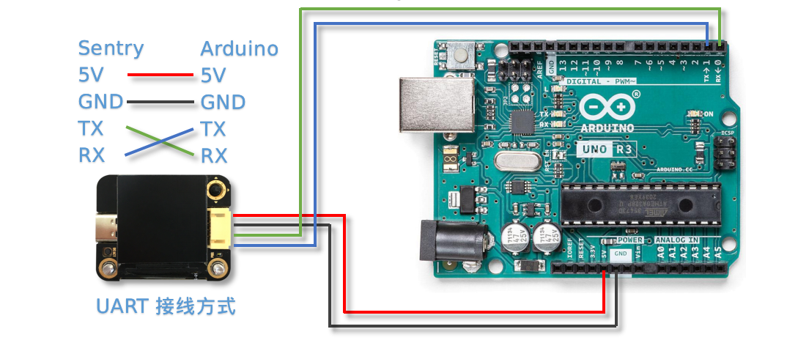
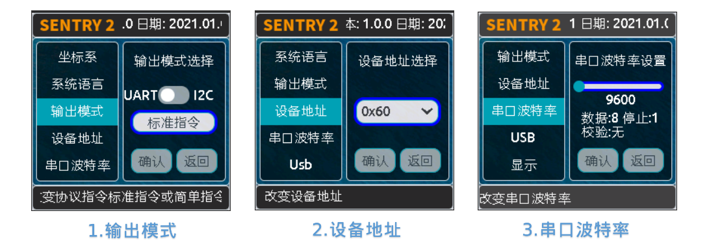

硬件介绍 
================

持续更新中...

简介
----------------
Sentry2视觉传感器采用先进的64位RISC-V神经网络处理器K210开发设计，集成多种先进的离线视觉处理算法，可以满足基本的视觉处理需求

应用领域:智能机器人、智能小车、创意设计、STEAM教育、创客比赛、智能玩具

**LED灯**：通过灯光不同的颜色可以反映出不同的识别结果，当设置为白光常亮时可以当作补光灯使用

**摄像头**：实时的采集图像数据，Sentry2提供了摄像头设置功能，可以调节图像缩放、白平衡、亮度、饱和度等参数，满足高阶玩家需求

**WiFi天线**：传感器板载ESP8285芯片，具有WiFi无线通信功能，可以实现云端图像识别，无线图传，无联网应用等功能，（**注意：功能尚未开发，后续固件支持**）

**K210处理器**：带有神经网络处理单元，双核64位RISC-V处理器，在MCU级别处理其中具有十分优秀的图像处理能力

**SD卡座**：支持Micro-SD（TF）卡，用于保存图片使用，（**注意：有些SD卡并不支持，仅支持SPI通讯方式，不支持SDIO功能**）

**USB**：板载USB-UART芯片，可以直接与电脑通信与控制，同时作为固件更新接口，（**注意：USB供电会通过通讯接口对外输出，二者不可同时供电**）

**LCD屏幕**：高清广视角的TFT-ISP彩色屏幕，带来小巧而优秀的图像显示效果，方便于算法调试

**摇杆按键**：可实现“上下左右中”的5个方向的控制，提供简单实用的UI交互

**复位按键**：可实现硬件复位，特殊情况下使用

**通讯接口**：图像处理数据与主控的交互接口，支持UART和I2C方式，可以在UI界面里设置

硬件参数
----------------

================    ================    ================    ================    ================    ================
项目                 单位                 最小值               典型值               最大值               备注
================    ================    ================    ================    ================    ================
工作电压              V                   3.3                 5.0                 5.0                 通讯口与USB不可同时供电
工作电流              mA                  100                 170                                     5V供电，关闭wifi功能
尺寸                 mm                                      40×32×12                                
重量                 g                                       15
定位孔间距            mm                                      32
定位孔直径            mm                                      3      
摄像头类型            NA                                      CMOS
摄像头分辨率          像素                 320×240             320×240             2592×1944
摄像头帧率            fps                 25                  50                  100
镜头视场角            度°                                      70                  
镜头焦距              mm                                      2.1     
屏幕类型              NA                                      TFT-ISP                                  
屏幕尺寸              英寸                                     1.3                                     
屏幕分辨率            像素                                     240×240                                  
================    ================    ================    ================    ================    ================

算法列表
----------------
================    ================    ================    ================
算法ID               名称                 英文名称             简介
================    ================    ================    ================
1                    颜色识别             Color               设置1～25个识别区域，返回每个区域中的颜色信息，如R，G，B值及分类标签
2                    色块检测             Blob                检测图像中是否包含一个或多个指定颜色的色块，返回其坐标和尺寸，可以通过设置色块尺寸用于滤除干扰
3                    标签识别             Apriltag            检测图像中是否有Apriltag图案，目前支持16H5，25H9,36H11编码，可以同时识别多个图案
4                    线条检测             Line                检测图像中的实心线条，返回线段的两个端点坐标及倾斜角度，曲线将被近似为直线段处理，可支持5个线段检测
5                    深度学习             Learning            对任意物体进行离线训练并进行识别
6                    卡片识别             Card                识别特制的卡片图案，10张交通卡片，9张形状卡片，10张数字卡片
7                    人脸识别             Face                检测与识别人脸，可以通过短按导航键来记录人脸数据，已记录的人脸将会分配一个Label标签用于分类
8                    20类物体             20Class             实现对20类常见物体的识别，诸如猫、椅子、人、汽车、电视等
9                    二维码               QrCode              识别简单的二维码，可自定义生成，但应符合以下条件：由基本ASCII码字符组成，不超过25个字符，白底黑格图案
11                   运动物体             Motion              判断图像中是否有移动区域，如果有，返回该区域的坐标和大小，传感器需处于静止状态，自身不可移动
================    ================    ================    ================

使用说明
----------------
Sentry2视觉传感器可以通过通讯接口与主控制器相连接，也可以通过USB与电脑连接。通讯接口可以在UI界面中配置为UART串口或I2C模式，还可以修改设备地址和波特率等参数。
**注意：USB与通讯接口不可以同时使用！！！**

连接主控
****************

接口定义
^^^^^^^^^^^^^^^^

================    ================    ================    ================
引脚序号              UART模式            I2C模式              备注
================    ================    ================    ================
1                   RX                  SDA
2                   TX                  SCL
3                   GND                 GND
4                   VCC                 VCC                 注意！！！当插入USB时，此端口可以对外部设备进行供电，此端口不可直接连接电池，当插入USB时不可接入3.3V系统，需要断开供电引脚
================    ================    ================    ================

接线方式
****************
以Arduino UNO举例说明

**UART模式**

**注意：UART模式下，视觉传感器的RX需要接Arduino的TX，传感器的TX接Arduino的RX**

**I2C模式**

.. image:: images/sentry2_connection_arduino_i2c.png

UI界面
****************

Sentry2视觉传感器具有2种UI界面：运行界面、设置界面

.. image:: images/run_view_and_ui_info.png

* 运行界面

    **算法状态**:此区域用于显示当前正在运行的算法

    **图像区域**:显示摄像头的图像

    **显示元素**:对被测物体进行标识，包括检测框、坐标、信息

    **系统状态**:显示当前帧率和当前图像缩放变焦值

* 设置界面

    **菜单选项**:上下拨动摇杆来选择不同的菜单，垂直短按摇杆可以进入相应的设置页面 

    **版本信息**:此处可以查看固件版本号和固件发布日期 

    **简介说明**:对当前菜单进行介绍说明 

    **控件按钮**:各种交互按键，用于进行设置操作，不同菜单下的控件是不同的

    **操作提示**:当摇杆悬停到不同的控件上时，会显示相应的介绍信息或操作说明，相当于说明书的作用

UI设置界面
^^^^^^^^^^^^^^^^

运行界面往右拨动摇杆可以进入UI设置界面，UI设置共有三个页面：算法设置、摄像头设置、硬件设置 

依次往左拨动摇杆则会逐次退出页面，直至返回运行界面

    **算法设置**:可以开启或关闭算法，配置算法参数 

    **摄像头设置**:用于调整摄像头的参数，可以对图像进行缩放、白平衡、饱和度、亮度、对比度等参数进行精细调节，需要具备一定的摄像头调参基础，适用于高阶玩家 

    **硬件设置**:用于配置通讯方式、波特率、设备地址、灯光颜色、语言等参数，以适配不同的使用模式 

硬件设置
****************

摇杆按键功能定义
^^^^^^^^^^^^^^^^
上电开机后便可以通过摇杆对视觉传感器进行操作，传感器采用5向导航摇杆，操作定义如下表所示：

================    ================    ================
当前模式              操作方式              动作含义          
================    ================    ================
运行模式              向上拨动              切换上个算法
运行模式              向下拨动              切换下个算法
运行模式              向左拨动              拍照（当插入SD时）
运行模式              向右拨动              进入GUI设置模式
运行模式              垂直短按              保存当前模型（部分算法有效）
运行模式              向上长按              放大镜头焦距Zoom
运行模式              向下长按              缩小镜头焦距Zoom
运行模式              向左长按              关闭/开启屏幕
运行模式              向右长按              暂无定义
运行模式              垂直长按              删除所有保存的模型（部分算法有效）
...
设置模式              向上拨动              切换上一个菜单或控件
设置模式              向下拨动              切换下一个菜单或控件
设置模式              向左拨动              切换上一个设置界面/返回运行模式
设置模式              向右拨动              切换下一个设置界面
设置模式              垂直短按              进入控件进行参数设置
================    ================    ================

*提示：拨动即为短按，长按需要至少为2秒以上的保持时间后再松开*

设置通讯方式
^^^^^^^^^^^^^^^^

用于设置视觉传感器与主控的通讯方式，设置后会自动保存，下次开机后不必再次设置，但当通讯异常时，需要检查这些参数是否被改变，有时固件更新后或调用了某些复位寄存器后会改变这些设置，此时需要重新设置

1. 在运行界面往右拨动3次摇杆，进入硬件设置界面
 
2. 在“输出模式”选项上，压按摇杆进入设置
 
3. 选择”UART“或”I2C“模式，一般来说，如果主控的UART端口无法支持高波特率，那么I2C的读取速度会更快，有利于提高图像处理帧率

4. 如果使用“UART模式”，那么还需要选择“标准指令”协议或“简单指令“协议，标准指令需要配合寄存器和驱动库进行开发，而简单指令只需要通过串口发送字符即可，具体区别可以查看相关章节介绍
 
5. 点击”确认“返回到菜单栏 

6. 往下拨动摇杆，切换到”设备地址“菜单 
 
7. 查看设备地址,此地址应与主控代码中的保持一致,压按摇杆可以进入设置，地址可设置为”0x60～0x63“， 点击”确认“并返回 

8. 如果选择”UART模式“，则还需要往下拨动摇杆，切换到”串口波特率“菜单 

9. 压按摇杆进入设置，左右拨动摇杆来设置波特率，支持“9600、19200、38400、57600、115200、921600、1152000、2000000”波特率，较高的波特率将有利于图像识别帧率的提升，不同的主控可支持的最高波特率有所差异，需要查看主控的相关说明，当通讯异常时，可尝试降低波特率，默认为9600

10. 往左拨动3次摇杆，返回至运行界面

设置USB串口波特率
^^^^^^^^^^^^^^^^^^^^^^^^^^^^^^^^

Sentry2板载一个USB-UART端口，可以实现与电脑的交互通讯，其波特率可单独设置，数据通信方式基于“标准协议指令”或“简单协议指令”

1. 在运行界面往右拨动3次摇杆，进入硬件设置界面
 
2. 在“Usb”选项上，压按摇杆进入设置

3. 左右拨动摇杆可以设置其波特率，支持“9600、19200、38400、57600、115200、921600、1152000、2000000”波特率，电脑端推荐使用较高速的波特率，如115200

4. 点击”确认“并返回 

设置运行界面显示元素
^^^^^^^^^^^^^^^^^^^^^^^^^^^^^^^^

进行图像识别时，为了便于观察检测结果，需要对识别结果进行标识，Sentry2定义了3种标识元素：识别框、坐标、信息

.. image:: images/sentry2_set_display.png 

**识别框**:显示被测物体的轮廓范围，为一个矩形的方框，其大小为物体的宽和高，位置由物体的中心坐标来确定 

**坐标**:在图像中绘制出被测物体的水平和垂直坐标线，并显示其数值，X：水平位置，Y：垂直位置，W：物体宽度，H：物体高度

**信息**:显示物体的分类标签、名称内容等信息

*提示：当进行多结果检测时，绘制太多的元素可能会降低图像检测帧率，可适当关闭部分元素绘制功能* 

*提示：有些算法并不具备所有的绘制元素，比如“线条检测”不会绘制坐标线* 

*提示：当图像中没有显示任何检测结果时，可能是显示功能全部被关闭了，需要打开相关的功能即可* 

设置LED灯光颜色
^^^^^^^^^^^^^^^^^^^^^^^^^^^^^^^^

进行图像识别时，可以通过传感器前面的LED灯光来指示检测结果，每检测一帧图像，会闪烁一次灯光，灯光颜色和亮度可以进行自定义设置

.. image:: images/sentry2_set_led.png 

用户可以分别设置“检测到”物体时的灯光颜色和“未检测到”时的灯光颜色，每按一次控件，将会改变一个颜色，切换顺序如下：

.. image:: images/sentry2_led_color_list.png 

其中，黑色代表关闭灯光

当“检测到”和“未检测到”颜色相同时，LED灯光将保持常亮，不再闪烁

亮度调节范围为0～15,其中0为关闭灯光，15为最亮，如果只作为一般性指示功能，亮度设为1或2即可

* 关闭灯光
    在某些情况下，灯光可能会对图像识别产生干扰（如颜色类算法，近距离物体识别时，等），此时需要关闭灯光，有两种方式可以关闭的灯光：
    
    1. 将“检测到”和“未检测到”设置为黑色
    
    2. 将亮度设置为0

* 补光灯功能
    当环境较暗时，或者处于逆光环境情况下，需要开启补光灯来照明，可以按照下面的方式设置：
    
    1. 将“检测到”和“未检测到”都设为白色，此时LED灯光将保持白色常亮状态，不再闪烁

    2. 将亮度提高，比如设为最大15,此时发光最亮

设置坐标系
^^^^^^^^^^^^^^^^^^^^^^^^^^^^^^^^

Sentry2支持2种坐标系：绝对值坐标系、百分比坐标系

**绝对值坐标系**：返回图像中的实际坐标数据，与图像分辨率一致，水平方向范围“0～319”，垂直方向范围“0～239”，图像中心点坐标为（160,120），该模式具有更高的精确度。

**百分比坐标系**：将实际检测到的坐标结果量化至整幅图像“0～100”的范围区间内，返回其相对值坐标，水平X方向和垂直Y方向范围“0～100”，图像中心点坐标为（50,50）

算法设置
****************
* 设置算法ID
    所有算法具有相同的配置寄存器地址以及参数格式，为了区分当前是对哪个算法进行操作，需要先指定算法ID：
    在寄存器0x20-VISION_ID写入算法的ID编号，然后再配置其他算法相关寄存器。

* 算法参数Param
    首先需要设置0x23-PARAM_NUM告知传感器一共有几个参数需要读取，然后设置各参数的值。
    算法参数Param共用相同的寄存器地址，算法支持设置多组参数，为了区分当前是对哪组参数进行操作，需要指定参数ID：
    在寄存器0x24-PARAM_ID中写入参数的ID编号，然后再配置其他参数相关的寄存器。

* 开启/关闭算法
    在寄存器0x21-VISIO_CONF1中写入0x01,即可开启算法，写入0x00则关闭算法。

结果读取
****************
* 设置算法ID
    所有算法具有相同的结果寄存器地址以及参数格式，为了区分当前是对哪个算法进行操作，需要先指定算法ID：
    在寄存器0x20-VISION_ID写入算法的ID编号，然后再读取其他算法相关寄存器。

* 读取结果数量
    每帧图像处理完后会将处理结果数量更新至寄存器0x34-RESULT_NUM中，用户可以通过读取该寄存器得知有几个结果待读取。

* 读取算法结果
    图像处理完后会将结果更新至寄存器中，可能有多个结果输出，为了区分当前要读取哪个结果值，需要指定结果ID：
    在寄存器0x24-RESULT_ID写入待读取结果的ID编号，然后再读取相关的结果寄存器。

标准协议指令
----------------

格式
****************
START | LEN | ADDR | CMD | DATA | CHKSUM | END

========    ========    ================    ========
符号         含义         长度                描述
========    ========    ================    ========
START       帧头         1Byte               表示一个数据包的开始，始终为0xFF
LEN         长度         1Byte               数据包的总长度（字节），包含帧头和帧尾
ADDR        地址         1Byte               设备物理地址
CMD         指令         1Byte               指令代码，详见指令列表
DATA        数据         (LEN-6)Byte         数据内容，详见指令列表
CHKSUM      校验         1Byte               从帧头（含）到DATA数据的所有字节累加求和，进位丢弃
END         帧尾         1Byte               表示一个数据包的结束，始终为0xED
========    ========    ================    ========

数据交互方式
****************
Sentry2串口模式下采用应答机制，传感器的数据交互完全由主控设备控制，传感器不会主动向主控发送数据。数据交互时，由主控设备先发送指令帧，然后传感器将会返回一个或多个应答帧，完成一次数据交互。

指令介绍
****************
================    ================    ================
指令代码              名称                描述
================    ================    ================
0x01                SetRegister         设置寄存器
0x02                GetRegister         读取寄存器
0x20                SetParam            设置算法参数
0x21                SetParamGroup       按组设置算法参数
0x22                GetResult           读取算法结果
0x23                GetResultGroup      按组读取算法结果
================    ================    ================

* Param Group 参数组
    一组参数可以表示一个作用域，每组参数最多可包含5个参数值，不同的算法对这5个参数值的含义可能是不同的。
    
    仅有部分算法具有参数设置功能，有的算法还可以设置多组参数，每组参数由ParamID进行标记。
    
    比如颜色识别算法，要设置25个检测区域，则需要写入25组参数
* Param Value 参数值
    每组参数可以由5个参数值来描述，不同算法的参数值的含义并不相同，详见下表

    ================    ========================    ========================    ========================    ========================    ========================
    算法                 Param Value1                Param Value2                Param Value3                Param Value4                Param Value5 
    ================    ========================    ========================    ========================    ========================    ========================
    颜色识别              检测区域中心点x坐标            检测区域中心点y坐标            检测区域宽度w                 检测区域高度h                 无
    色块检测              无                          无                           最小色块宽度w                 最小色块高度h                 待检测的颜色分类标签
    ================    ========================    ========================    ========================    ========================    ========================
* Result Group 结果组
    一组数据表示一个检测结果，每组结果包含5个数据，但不同的算法对这5个数据的含义可能是不同的，部分算法可以返回多个结果，每组检测结果由ResultID进行标记。
* Result Data 结果数据
    ================    ========================    ========================    ========================    ========================    ========================    ========================
    算法                 Result Data1                Result Data1                Result Data3                Result Data4                Result Data5                备注
    ================    ========================    ========================    ========================    ========================    ========================    ========================
    颜色识别              R红色值                      G绿色值                      B蓝色值                      无                          颜色分类标签
    色块检测              中心x坐标                    中心y坐标                     宽度w                       高度h                        颜色分类标签
    线条检测              起点x坐标                    起点y坐标                     终点x坐标                    终点y坐标                     无
    卡片识别              中心x坐标                    中心y坐标                     宽度w                       高度h                        卡片分类标签
    人脸识别              中心x坐标                    中心y坐标                     宽度w                       高度h                        人脸分类标签                  只有训练记忆后人脸数据才有分类标签
    20类物体识别           中心x坐标                    中心y坐标                     宽度w                       高度h                        物体分类标签
    二维码识别            中心x坐标                    中心y坐标                     宽度w                       高度h                        字符数量                      后续结果组为字符数据
    移动物体检测           中心x坐标                    中心y坐标                     宽度w                       高度h                        无
    ================    ========================    ========================    ========================    ========================    ========================    ========================

* 0x01-SetRegister
    描述:设置寄存器，每次只可设置一个寄存器（一个字节）

    指令帧CMD：0x01

    ================    ================    ================    ================    ================    ================    ================
    Byte1               Byte2               Byte3               Byte4               Byte5               Byte6               Byte7           
    ================    ================    ================    ================    ================    ================    ================
    寄存器地址            待写入数据
    ================    ================    ================    ================    ================    ================    ================

    应答帧CMD：0xE0

    ================    ================    ================    ================    ================    ================    ================
    Byte1               Byte2               Byte3               Byte4               Byte5               Byte6               Byte7           
    ================    ================    ================    ================    ================    ================    ================
    0x01                已写入数据
    ================    ================    ================    ================    ================    ================    ================

* 0x02-GetRegister
    描述:读取寄存器，每次只可读取一个寄存器（一个字节）

    指令帧CMD：0x02

    ================    ================    ================    ================    ================    ================    ================
    Byte1               Byte2               Byte3               Byte4               Byte5               Byte6               Byte7           
    ================    ================    ================    ================    ================    ================    ================
    寄存器地址            
    ================    ================    ================    ================    ================    ================    ================

    应答帧CMD：0xE0

    ================    ================    ================    ================    ================    ================    ================
    Byte1               Byte2               Byte3               Byte4               Byte5               Byte6               Byte7           
    ================    ================    ================    ================    ================    ================    ================
    0x02                读取的数据
    ================    ================    ================    ================    ================    ================    ================

* 0x20-SetParam
    描述:设置指定算法同一类型的参数值，可以同时设置多个数据，比如单独设置颜色识别算法10个检测区域的x坐标

    指令帧-0x20

    ================    ================    ================    ================    ================    ================    ================
    Byte1               Byte2               Byte3               Byte4               Byte5               Bytes               Bytes    
    ================    ================    ================    ================    ================    ================    ================
    算法ID               参数类型             起始ParamID1         结束ParamIDn         参数1               参数2                参数n
    ================    ================    ================    ================    ================    ================    ================

    应答帧CMD：0xE0

    ================    ================    ================    ================    ================    ================    ================
    Byte1               Byte2               Byte3               Byte4               Byte5               Byte6               Byte7           
    ================    ================    ================    ================    ================    ================    ================
    0x20                算法ID
    ================    ================    ================    ================    ================    ================    ================

* 0x21-SetParamGroup
    描述:设置指定算法的参数组数据，每个参数组包含5个数据项，比如同时设置颜色识别算法的5个检测区域x，y，w，h信息

    指令帧CMD：0x21

    ================    ================    ================    ================    ================    ================    ================
    Byte1               Byte2               Byte3               Byte4               Bytes               Bytes               Bytes
    ================    ================    ================    ================    ================    ================    ================
    算法ID               起始ParamID1         结束ParamIDn        参数组1              参数组2              参数组n
    ================    ================    ================    ================    ================    ================    ================

    应答帧CMD：0xE0

    ================    ================    ================    ================    ================    ================    ================
    Byte1               Byte2               Byte3               Byte4               Byte5               Byte6               Byte7           
    ================    ================    ================    ================    ================    ================    ================
    0x21                算法ID
    ================    ================    ================    ================    ================    ================    ================

* 0x22-GetResult
    描述:获取指定算法算法的某一类型的检测结果，比如只获取颜色识别的标签数据，而不关心xy坐标

    指令帧CMD：0x22

    ================    ================    ================    ================    ================    ================    ================
    Byte1               Byte2               Byte3               Byte4               Byte5               Bytes               Bytes    
    ================    ================    ================    ================    ================    ================    ================
    算法ID               数据类型             起始ResultID         结束ResultID         
    ================    ================    ================    ================    ================    ================    ================

    因为每个数据帧的最大长度只有255个字节，当检测结果帧数据长度超过此值时，将会产生多个数据帧，当CMD为0xEC时表示中间帧，为0xE0时表示结束帧
    
    应答帧CMD：0xEC或0xE0

    ================    ================    ================    ================    ================    ================    ================
    Byte1               Byte2               Byte3               Byte4               Byte5               Byte6               Bytes           
    ================    ================    ================    ================    ================    ================    ================
    0x22                图像帧号             算法ID               数据类型            起始ResultID1        结束ResultIDn        结果数据
    ================    ================    ================    ================    ================    ================    ================

* 0x23-GetResultGroup
    描述:获取指定算法每组的检测结果，一组检测结果包含5个数据项，比如同时获取颜色识别算法的5个区域的RGB值和分类标签值

    指令帧CMD：0x23

    ================    ================    ================    ================    ================    ================    ================
    Byte1               Byte2               Byte3               Byte4               Byte5               Bytes               Bytes    
    ================    ================    ================    ================    ================    ================    ================
    算法ID               数据类型             起始ResultID         结束ResultID         
    ================    ================    ================    ================    ================    ================    ================

    因为每个数据帧的最大长度只有255个字节，当检测结果帧数据长度超过此值时，将会产生多个数据帧，当CMD为0xEC时表示中间帧，为0xE0时表示结束帧
    
    应答帧CMD：0xEC或0xE0

    ================    ================    ================    ================    ================    ================    ================
    Byte1               Byte2               Byte3               Byte4               Byte5               Byte6               Bytes    
    ================    ================    ================    ================    ================    ================    ================
    0x23                图像帧号             算法ID               起始ResultID1        结束ResultIDn        结果组1              结果组n
    ================    ================    ================    ================    ================    ================    ================

简单协议指令
----------------

格式
****************
CMD | ID 

========    ================    ================    ========================
符号         含义                 长度                描述
========    ================    ================    ========================
CMD         指令字符              1                   指令字符，详见指令列表
ID          ID数字编号            1                   ID编号，可以为算法编号或结果编号
========    ================    ================    ========================

指令列表
****************

================================    ========================    ================================================    ========================================    ========================
操作                                    指令字符                       ID数字编号                                       返回                                            举例
================================    ========================    ================================================    ========================================    ========================
开启算法                               O 或 o                        算法编号                                           1：成功 0：失败                            O7开启人脸识别 
关闭算法                               C 或 c                        算法编号                                           1：成功 0：失败                            C7关闭人脸识别
查询检测结果数量                        N 或 n                        算法编号                                           检测到物体的数量，0为未检测到                       N7返回人脸数量 
获取水平x坐标                           X 或 x                        检测结果的编号，可省略，默认为1                       物体的水平x坐标值，0～319范围                    X1返回第1个人脸x坐标 
获取垂直y坐标                           Y 或 y                        检测结果的编号，可省略，默认为1                       物体的垂直y坐标值，0～239范围                    Y3返回第3个人脸y坐标 
获取物体w宽度                           W 或 w                        检测结果的编号，可省略，默认为1                       物体的宽度w值，0～319范围                        W返回第1个人脸宽度 
获取物体h高度                           H 或 h                        检测结果的编号，可省略，默认为1                       物体的高度h值，0～239范围                        H返回第1个人脸高度 
获取物体分类标签                        L 或 l                       检测结果的编号，可省略，默认为1                        物体的分类标签label值                            L2返回第2个人脸的分类标签
================================    ========================    ================================================    ========================================    ========================

寄存器
---------
请联系我们

