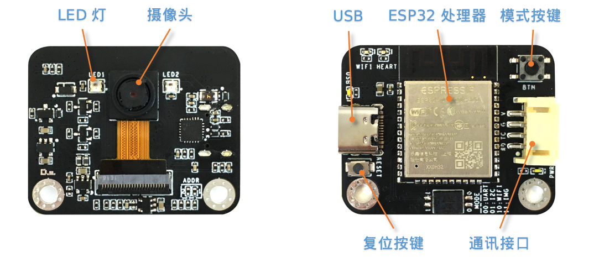
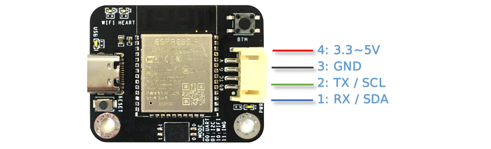
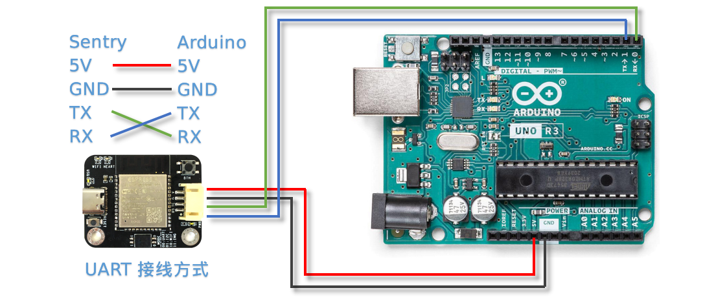
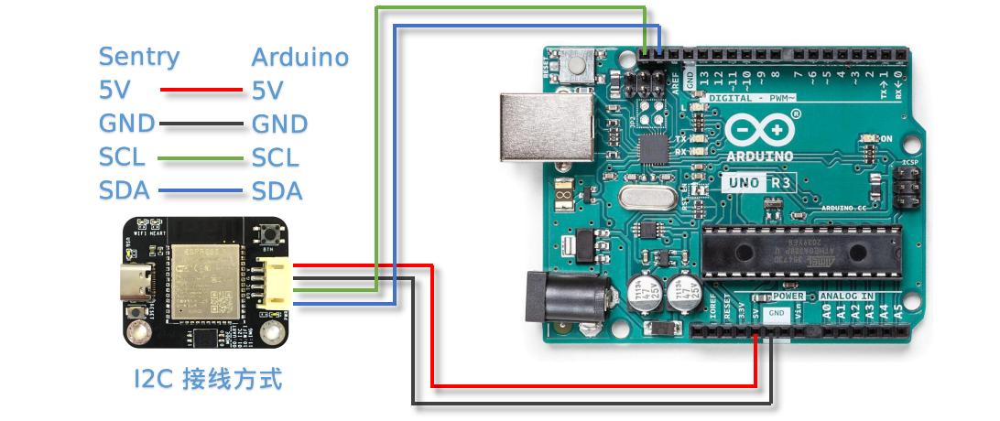
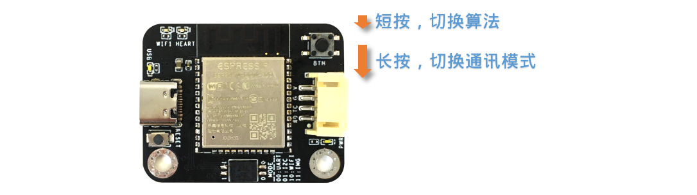
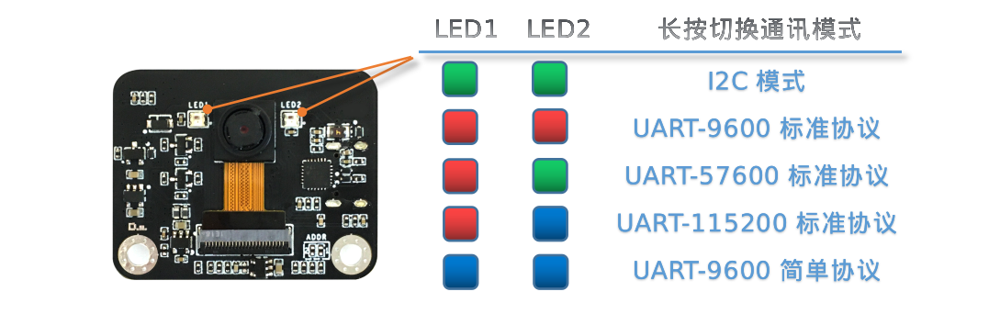
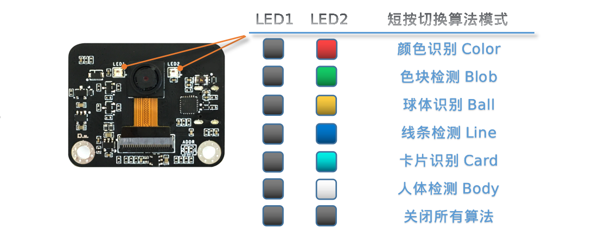

.. _chapter_vs1_hardware_index:

硬件介绍 
================

简介
----------------
Sentry1视觉传感器采用双核240MHz-ESP32处理器，可以满足入门级的视觉处理需求，适合于青少年教学与创客作品。

应用领域:智能机器人、智能小车、创客作品、STEAM教育、智能玩具

**LED灯**：通过灯光不同的颜色可以反映出不同的识别结果，当设置为白光常亮时可以当作补光灯使用

**摄像头**：实时的采集图像数据

**ESP32处理器**：双核240MHz处理器

**USB**：板载USB-UART芯片，可以直接与电脑通信与控制，同时作为固件更新接口，（**注意：USB供电会通过通讯接口对外输出，二者不可同时供电**）

**模式按键**：短按实现算法切换，长按实现通讯模式切换

**复位按键**：可实现硬件复位，特殊情况下使用

**通讯接口**：图像处理数据与主控的交互接口，支持UART和I2C方式

硬件参数
----------------

================    ================    ================    ================
项目                 单位                 参数                  备注
================    ================    ================    ================
工作电压              V                   3.3～5.0            通讯口与USB不可同时供电
工作电流              mA                  90                  5V供电，开启算法时的典型值
尺寸                 mm                  40x32x12.5          不带外壳
重量                 g                   9                   不带外壳
定位孔间距            mm                  32
定位孔直径            mm                  3
摄像头类型            NA                  CMOS
摄像头分辨率          像素                 200W
摄像头帧率            fps                 25
镜头视场角            度°                  68                                 
================    ================    ================    ================   

算法列表
----------------

算法详细介绍可参阅:
:ref:`算法介绍<chapter_vs1_vision_index>`
章节

================    ================================================    ================      ================================
算法ID               名称                                                 英文名称                   简介                                                                                                                           
================    ================================================    ================      ================================
1                    :ref:`颜色识别<chapter_vs1_vision_color_index>`          Color                  可设置识别区域，返回区域中的颜色信息，如R，G，B值及分类标签
2                    :ref:`色块检测<chapter_vs1_vision_blob_index>`           Blob                   检测图像中是否有指定的色块，支持黑、白、红、绿、蓝、黄6种色块检测
3                    :ref:`球体识别<chapter_vs1_vision_ball_index>`           Ball                   可以检测识别橙色乒乓球或者绿色的网球
4                    :ref:`线条检测<chapter_vs1_vision_line_index>`           Line                   检测图像中的线条，返回两个端点坐标及倾斜角度
6                    :ref:`卡片识别<chapter_vs1_vision_card_index>`           Card                   识别特制的5张交通卡片图案，包含前进，左转、右转、调头和停车
7                    :ref:`人体检测<chapter_vs1_vision_body_index>`           Body                   可以检测到人体
================    ================================================    ================      ================================ 

开发平台与驱动库
----------------

================================================    ================================    ================================    ========================================================================================================    ================    ================
开发平台                                              编程语言                             主控设备                            驱动库链接                                                                                                       企业版              消费版
================================================    ================================    ================================    ========================================================================================================    ================    ================
:ref:`Arduino<chapter_vs1_arduino_index>`               C/C++                                Arduino                            https://github.com/AITosee/Sentry-Arduino/releases                                                             支持                支持
:ref:`MakeCode<chapter_vs1_makecode_index>`             图形化                               Micro:bit                           https://github.com/AITosee/pxt-sentry/releases                                                                  支持                支持
:ref:`Mind+<chapter_vs1_mindplus_index>`                图形化，C/C++，MicroPython            Arduino、Micro:bit、掌控板             https://github.com/AITosee/ext-sentry/releases                                                                支持                支持
:ref:`Mixly<chapter_vs1_mixly_index>`                   图形化                                Arduino                             https://github.com/AITosee/Sentry-Mixly/releases                                                               支持                支持
:ref:`BXY<chapter_vs1_micropython_index>`               MicroPython                          Micro:bit、掌控板                    https://github.com/AITosee/Sentry-microPython/releases                                                         支持                支持
================================================    ================================    ================================    ========================================================================================================    ================    ================

使用说明
----------------
Sentry1视觉传感器可以通过通讯接口与主控制器相连接，也可以通过USB与电脑连接。

驱动库、固件、资料手册、第三方资源等可参阅:
:ref:`资源下载<chapter_vs1_download_index>`
章节

**注意：USB与通讯接口不可以同时供电！！！**

连接主控
************************

接口定义
^^^^^^^^^^^^^^^^^^^^^^^^^^^^^^^^

================    ================    ================    ================
引脚序号              UART模式            I2C模式              备注
================    ================    ================    ================
1                   RX                  SDA
2                   TX                  SCL
3                   GND                 GND
4                   VCC                 VCC                 注意！！！当插入USB时，此端口可以对外部设备进行供电，此端口不可直接连接电池，当插入USB时不可接入3.3V系统，需要断开供电引脚
================    ================    ================    ================

接线方式
************************
以Arduino UNO举例说明

**UART模式**

**注意：UART模式下，视觉传感器的RX需要接Arduino的TX，传感器的TX接Arduino的RX**

**注意：如果使用软串口，可以指定其他的IO口，详见Arduino中的SoftSerialExample**

**注意：由于Arduino的RX和TX与烧录固件共用端口，因此在烧录程序时，需要断开RX，TX接线，推荐使用I2C或软串口模式**

**I2C模式**

模式按键
************************

长按模式按键可以切换通讯模式，短按模式按键可以循环切换算法。不同的模式之间通过LED灯光颜色进行指示

长按切换通讯模式
^^^^^^^^^^^^^^^^^^^^^^^^^^^^^^^^
长按模式按键3秒以上，则可以切换通讯模式，目前提供5种方式：I2C模式、串口9600波特率标准协议、串口57600波特率标准协议、串口115200波特率标准协议、串口9600简单协议

每次长按后会切换一种模式并自动重启传感器，通讯方式会自动保存，下次开机后仍未该模式，不必再次切换

在开机时会闪烁2次LED灯光来表明当前是哪种通讯模式，对应颜色如下所示：

其中：

I2C模式：采用I2C总线通讯协议，具有较高的通讯效率

UART-9600标准协议、UART-57600标准协议、UART-115200标准协议：此3种模式采用串口通讯，后面的数字为不同的波特率，根据主控平台选择合适的波特率。
标准协议指带有通讯格式的指令，需要进行解析处理，一般配合驱动库使用
一般来说，波特率值越大，则越有助于减少数据通讯时间，提高处理速率，但有的主控或者使用“软串口”时无法支持高波特率

UART-9600简单协议：采用串口通讯，波特率为9600,协议为简单协议，只需发送和接收字符即可，适合于简单的应用，可以跨多种主控平台使用

短按切换算法模式
^^^^^^^^^^^^^^^^^^^^^^^^^^^^^^^^
短按模式按键可以快速切换算法，每次切换算法会自动关闭上一个算法。

算法在开启时，会闪烁2次LED来表明当前是哪种算法模式，对应颜色如下所示：

其中：

黑色表示LED处于熄灭状态

开启算法
************************

除了可以通过模式按键开启算法外，还支持通过协议指令开启算法

该方式需要由主控设备读写寄存器来实现算法的开启或关闭，我们在多个编程平台提供了封装好的驱动库给用户使用

串口模式需要依照“标准协议指令”或“简单协议指令”来读写控制，详见相关章节介绍

I2C模式可直接读写寄存器

算法开启流程如下：
    
1. 向寄存器 0x20-VISION_ID 写入要开启的算法ID号
    
2. 向寄存器 0x21-VISIO_CONF1 中写入0x01,即可开启算法，写入0x00则关闭算法

详细设置，请查询寄存器列表

检测结果
************************

通过指令读取检测结果
^^^^^^^^^^^^^^^^^^^^^^^^^^^^^^^^

该方式需要由主控设备读写寄存器来读取结果，我们在多个编程平台提供了封装好的驱动库给用户使用

串口模式需要依照“标准协议指令”或“简单协议指令”来读写控制，详见相关章节介绍

I2C模式可直接读写寄存器

识别结果读取流程如下：
    
1. 向寄存器 0x20-VISION_ID 写入要读取的算法ID号
    
2. 读取寄存器 0x34-RESULT_NUM 的值来获取当前是否检测到目标物体，例如，返回1,则表明检测到了物体，返回0则表明未检测到

3. 向寄存器 0x24-RESULT_ID 写入待读取的结果编号，例如，写入1代表读取第1组结果，Sentry1只支持单个检测结果

4. 读取寄存器 0x80~0x89 的值来获取检测结果

    ========    ========================    ========================
    地址         名称                           含义
    ========    ========================    ========================
    0x80        RESULT_DATA1_H8             检测结果1,高8位
    0x81        RESULT_DATA1_L8             检测结果1,低8位
    0x82        RESULT_DATA2_H8             检测结果2,高8位
    0x83        RESULT_DATA2_L8             检测结果2,低8位
    0x84        RESULT_DATA3_H8             检测结果3,高8位
    0x85        RESULT_DATA3_L8             检测结果3,低8位
    0x86        RESULT_DATA4_H8             检测结果4,高8位
    0x87        RESULT_DATA4_L8             检测结果4,低8位
    0x88        RESULT_DATA5_H8             检测结果5,高8位
    0x89        RESULT_DATA5_L8             检测结果5,低8位
    ========    ========================    ========================

详细设置，请查询寄存器列表

.. _chapter_vs1_hardware_standard_protocol_index:

标准协议指令
----------------

在串口模式下，主控与Sentry1的数据交互需要通过协议来进行，标准协议指令具有规范的数据格式，结合寄存器表可以实现完整的数据交互功能和较高的通信效率。

指令格式
****************
START | LEN | ADDR | CMD | DATA | CHKSUM | END

========    ========    ================    ========
符号         含义         长度                描述
========    ========    ================    ========
START       帧头         1Byte               表示一个数据包的开始，始终为0xFF
LEN         长度         1Byte               数据包的总长度（字节），包含帧头和帧尾
ADDR        地址         1Byte               设备物理地址
CMD         指令         1Byte               指令代码，详见指令列表
DATA        数据         (LEN-6)Byte         数据内容，详见指令列表
CHKSUM      校验         1Byte               从帧头（含）到DATA数据的所有字节累加求和，进位丢弃
END         帧尾         1Byte               表示一个数据包的结束，始终为0xED
========    ========    ================    ========

数据交互方式
************************
串口模式下采用应答机制，传感器的数据交互完全由主控设备控制，传感器不会主动向主控发送数据。数据交互时，由主控设备先发送指令帧，然后传感器将会返回一个或多个应答帧，完成一次数据交互。

指令介绍
************************
================    ================    ================
指令代码              名称                描述
================    ================    ================
0x01                SetRegister         设置寄存器
0x02                GetRegister         读取寄存器
0x20                SetParam            设置算法参数
0x21                SetParamGroup       按组设置算法参数
0x22                GetResult           读取算法结果
0x23                GetResultGroup      按组读取算法结果
0x24                SetResult           设置算法结果
0x25                SetResultGroup      按组设置算法结果
================    ================    ================

* Param Group 参数组
    一组参数可以表示一个作用区域，每组参数最多可包含5个参数值，不同的算法对这5个参数值的含义可能是不同的。
    
    仅有部分算法具有参数设置功能，有的算法还可以设置多组参数，每组参数由Param ID进行标记。

* Param Value 参数值
    每组参数可以由5个参数值来描述，不同算法的参数值的含义并不相同，详见下表

    ================    ========================    ========================    ========================    ========================    ========================
    算法                 Param Value1                Param Value2                Param Value3                Param Value4                Param Value5 
    ================    ========================    ========================    ========================    ========================    ========================
    颜色识别              检测区域中心点x坐标            检测区域中心点y坐标            检测区域宽度w                 检测区域高度h                 无
    色块检测              无                          无                           最小色块宽度w                 最小色块高度h                 待检测的颜色分类标签
    ================    ========================    ========================    ========================    ========================    ========================
* Result Group 结果组
    一组数据表示一个检测结果，每组结果包含5个数据，但不同的算法对这5个数据的含义可能是不同的，部分算法可以返回多个结果，每组检测结果由ResultID进行标记。
* Result Data 结果数据
    ================    ========================    ========================    ========================    ========================    ========================    ========================
    算法                 Result Data1                Result Data1                Result Data3                Result Data4                Result Data5                备注
    ================    ========================    ========================    ========================    ========================    ========================    ========================
    颜色识别              R红色通道值                  G绿色通道值                   B蓝色通道值                    无                          颜色分类标签
    色块检测              中心x坐标                    中心y坐标                     宽度w                       高度h                        颜色分类标签
    线条检测              终点x坐标                    终点y坐标                     起点x坐标                    起点y坐标                     线段角度
    球体识别              中心x坐标                    中心y坐标                     宽度w                       高度h                        分类标签
    卡片识别              中心x坐标                    中心y坐标                     宽度w                       高度h                        分类标签
    人体检测              中心x坐标                    中心y坐标                     宽度w                       高度h                        无                      分类标签需要先进行训练
    ================    ========================    ========================    ========================    ========================    ========================    ========================

* 0x01-SetRegister
    描述:设置寄存器，每次只可设置一个寄存器（一个字节）

    指令帧CMD：0x01

    ================    ================    ================    ================    ================    ================    ================
    Byte1               Byte2               Byte3               Byte4               Byte5               Byte6               Byte7           
    ================    ================    ================    ================    ================    ================    ================
    寄存器地址            待写入数据
    ================    ================    ================    ================    ================    ================    ================

    应答帧CMD：0xE0

    ================    ================    ================    ================    ================    ================    ================
    Byte1               Byte2               Byte3               Byte4               Byte5               Byte6               Byte7           
    ================    ================    ================    ================    ================    ================    ================
    0x01                已写入数据
    ================    ================    ================    ================    ================    ================    ================

* 0x02-GetRegister
    描述:读取寄存器，每次只可读取一个寄存器（一个字节）

    指令帧CMD：0x02

    ================    ================    ================    ================    ================    ================    ================
    Byte1               Byte2               Byte3               Byte4               Byte5               Byte6               Byte7           
    ================    ================    ================    ================    ================    ================    ================
    寄存器地址            
    ================    ================    ================    ================    ================    ================    ================

    应答帧CMD：0xE0

    ================    ================    ================    ================    ================    ================    ================
    Byte1               Byte2               Byte3               Byte4               Byte5               Byte6               Byte7           
    ================    ================    ================    ================    ================    ================    ================
    0x02                读取的数据
    ================    ================    ================    ================    ================    ================    ================

* 0x20-SetParam
    描述:设置指定算法同一类型的参数值，可以同时设置多个数据，比如单独设置颜色识别算法10个检测区域的x坐标

    指令帧-0x20

    ================    ================    ================    ================    ================    ================    ================
    Byte1               Byte2               Byte3               Byte4               Byte5               Byte6               Bytes    
    ================    ================    ================    ================    ================    ================    ================
    算法ID               参数类型             起始ParamID1         结束ParamIDn         参数1               参数2                参数n
    ================    ================    ================    ================    ================    ================    ================

    应答帧CMD：0xE0

    ================    ================    ================    ================    ================    ================    ================
    Byte1               Byte2               Byte3               Byte4               Byte5               Byte6               Byte7           
    ================    ================    ================    ================    ================    ================    ================
    0x20                算法ID
    ================    ================    ================    ================    ================    ================    ================

* 0x21-SetParamGroup
    描述:设置指定算法的参数组数据，每个参数组包含5个数据项，比如同时设置颜色识别算法的5个检测区域x，y，w，h信息

    指令帧CMD：0x21

    ================    ================    ================    ================    ================    ================    ================
    Byte1               Byte2               Byte3               Byte4               Bytes               Bytes               Bytes
    ================    ================    ================    ================    ================    ================    ================
    算法ID               起始ParamID1         结束ParamIDn        参数组1              参数组2              参数组n
    ================    ================    ================    ================    ================    ================    ================

    应答帧CMD：0xE0

    ================    ================    ================    ================    ================    ================    ================
    Byte1               Byte2               Byte3               Byte4               Byte5               Byte6               Byte7           
    ================    ================    ================    ================    ================    ================    ================
    0x21                算法ID
    ================    ================    ================    ================    ================    ================    ================

* 0x22-GetResult
    描述:获取指定算法算法的某一类型的检测结果，比如只获取颜色识别的标签数据，而不关心xy坐标

    指令帧CMD：0x22

    ================    ================    ================    ================    ================    ================    ================
    Byte1               Byte2               Byte3               Byte4               Byte5               Byte6               Byte7    
    ================    ================    ================    ================    ================    ================    ================
    算法ID               数据类型             起始ResultID         结束ResultID         
    ================    ================    ================    ================    ================    ================    ================

    因为每个数据帧的最大长度只有255个字节，当检测结果帧数据长度超过此值时，将会产生多个数据帧，当CMD为0xEC时表示中间帧，为0xE0时表示结束帧
    
    应答帧CMD：0xEC或0xE0

    ================    ================    ================    ================    ================    ================    ================
    Byte1               Byte2               Byte3               Byte4               Byte5               Byte6               Bytes           
    ================    ================    ================    ================    ================    ================    ================
    0x22                图像帧号             算法ID              数据类型            起始ResultID1        结束ResultIDn        结果数据
    ================    ================    ================    ================    ================    ================    ================

* 0x23-GetResultGroup
    描述:获取指定算法每组的检测结果，一组检测结果包含5个数据项，比如同时获取颜色识别算法的5个区域的RGB值和分类标签值

    指令帧CMD：0x23

    ================    ================    ================    ================    ================    ================    ================
    Byte1               Byte2               Byte3               Byte4               Byte5               Byte6               Byte7    
    ================    ================    ================    ================    ================    ================    ================
    算法ID               起始ResultID         结束ResultID         
    ================    ================    ================    ================    ================    ================    ================

    因为每个数据帧的最大长度只有255个字节，当检测结果帧数据长度超过此值时，将会产生多个数据帧，当CMD为0xEC时表示中间帧，为0xE0时表示结束帧
    
    应答帧CMD：0xEC或0xE0

    ================    ================    ================    ================    ================    ================    ================
    Byte1               Byte2               Byte3               Byte4               Byte5               Byte6               Bytes    
    ================    ================    ================    ================    ================    ================    ================
    0x23                图像帧号             算法ID               起始ResultID1        结束ResultIDn        结果组1              结果组n
    ================    ================    ================    ================    ================    ================    ================

* 0x24-SetResult
    描述:设置指定算法算法的某一类型的检测结果，用于将WiFi芯片中自定义算法的结果写入K210寄存器中，以便主控读取

    指令帧CMD：0x24

    ================    ================    ================    ================    ================    ================    ================
    Byte1               Byte2               Byte3               Byte4               Byte5               Byte6               Byte7    
    ================    ================    ================    ================    ================    ================    ================
    算法ID               数据类型             起始ResultID         结束ResultID         
    ================    ================    ================    ================    ================    ================    ================

    应答帧CMD：0xE0

    ================    ================    ================    ================    ================    ================    ================
    Byte1               Byte2               Byte3               Byte4               Byte5               Byte6               Byte7           
    ================    ================    ================    ================    ================    ================    ================
    0x24                算法ID               
    ================    ================    ================    ================    ================    ================    ================

* 0x25-SetResultGroup
    描述:设置指定算法每组的检测结果，一组检测结果包含5个数据项，用于将WiFi芯片中自定义算法的结果写入K210寄存器中，以便主控读取

    指令帧CMD：0x25

    ================    ================    ================    ================    ================    ================    ================
    Byte1               Byte2               Byte3               Byte4               Byte5               Bytes               Bytes    
    ================    ================    ================    ================    ================    ================    ================
    算法ID               起始ResultID         结束ResultID         
    ================    ================    ================    ================    ================    ================    ================
    
    应答帧CMD：0xE0

    ================    ================    ================    ================    ================    ================    ================
    Byte1               Byte2               Byte3               Byte4               Byte5               Byte6               Bytes    
    ================    ================    ================    ================    ================    ================    ================
    0x25                算法ID  
    ================    ================    ================    ================    ================    ================    ================

.. _chapter_vs1_hardware_simple_protocol_index:

简单协议指令
----------------

该指令没有复杂的协议规范，只需要通过串口发送简单的字母和数字就可以开启算法和获取数据，无需开发驱动库，适用于任何有UART功能的主控平台，但也只适合简单的应用场景

指令格式
************************
CMD | ID | END

========    ================    ================    ========================
符号         含义                 长度                描述
========    ================    ================    ========================
CMD         指令字符              1                   指令字符，详见指令列表
ID          ID数字编号            1                   ID编号，可以为算法编号或结果编号
END         结束符                1                   可以为换行符，回车符，或者空格
========    ================    ================    ========================

指令列表
************************

================================    ========================    ================================================    =====================================================================================        ========================
操作                                    指令字符                       ID数字编号                                       返回                                                                                            举例
================================    ========================    ================================================    =====================================================================================        ========================
开启算法                               O 或 o                        算法编号                                          1：成功， 0：失败                                                                               O6开启卡片识别 
关闭算法                               C 或 c                        算法编号                                          1：成功， 0：失败                                                                               C6关闭卡片识别
查询检测结果数量                        N 或 n                        算法编号                                          检测到物体的数量，0为未检测到                                                                      N6返回卡片数量 
获取水平x坐标                           X 或 x                        检测结果的编号，可省略，默认为1                      物体的水平坐标值                                                                                 X返回卡片x坐标 
获取垂直y坐标                           Y 或 y                        检测结果的编号，可省略，默认为1                      物体的垂直坐标值                                                                                 Y返回卡片y坐标 
获取物体w宽度                           W 或 w                        检测结果的编号，可省略，默认为1                      物体的宽度值                                                                                    W返回卡片宽度 
获取物体h高度                           H 或 h                        检测结果的编号，可省略，默认为1                      物体的高度值                                                                                    H返回卡片高度 
获取物体分类标签                        L 或 l                         检测结果的编号，可省略，默认为1                     物体的分类标签                                                                                   L返回卡片分类标签
获取所有结果                            A 或 a                        检测结果的编号，可省略，默认为1                     :ref:`返回结果说明<chapter_vs1_hardware_simple_protocol_a_index>`                                    A返回卡片识别的所有结果
================================    ========================    ================================================    =====================================================================================        ========================

.. _chapter_vs1_hardware_simple_protocol_a_index:

**指令A返回结果说明**

返回格式为：A+001+002+003+004+005

其中001为X坐标，002为Y坐标，003为W宽度，004为H高度，005为L标签

为方便解析，每个结果采用3位固定的数字组成，不足部分用0填充

**注意，对于线段检测和二维码等具有特殊返回结果的算法，返回结果的含义见各算法的介绍**

寄存器
----------------
请联系我们

技术：support@aitosee.com

销售：sales@aitosee.com

