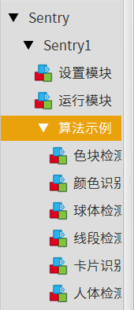

.. _chapter_vs1_mixly_index:

Sentry1-Mixly 开发文档
======================

Sentry-Mixly 库是一个专门为 Mixly 图形化编程打造的驱动库，适用于 Sentry 系列产品。

安装
----

1. `下载 <https://mixly.cn/explore/software>`_ 并安装Mixly，建议安装路径不要存在中文
2. 根据Mixly的版本号 `下载 <https://github.com/AITosee/Sentry-Mixly/releases>`_ 对应的Sentry的驱动库

   .. attention::
        - Sentry-Mixly-v2.x.x.zip                 适用于Mixly3.0以及Mixly2.0rc4
        - Sentry-Mixly-v2.x.x_mixly2.0rc3.zip     适用于Mixly2.0rc3
        - Sentry-Mixly-v2.x.x_mixly1.x.zip        适用于Mixly1.x

3. 打开Mixly，点击右上角 设置->管理库->导入库->本地导入，选择下载的驱动库压缩包
4. 左侧菜单栏出现Sentry视觉传感器，并且代码块均正常显示，则导入成功

例程
----

Mixly 例程在库的第三栏 ``算法示例``，点开即有每种算法调用的基础方法。

模块介绍
--------

1. 初始化 Sentry

    .. image:: images/mixly_sentry1_init.png

    - 参数 1：端口类型
    - 参数 2：Sentry 设备地址

2. 开启/关闭算法

    .. image:: images/mixly_sentry1_vision_begin.png

    - 参数 1：启用/关闭算法
    - 参数 2：算法类型

3. 获取算法检测到的结果数量

    .. image:: images/mixly_sentry1_get_status.png

    - 参数 1：算法类型
    - 返回：算法检测到的结果数量

4. 获取算法检测到的物体位置

    .. image:: images/mixly_sentry1_get_value.png

    - 参数 1：算法类型
    - 参数 2：需要获取的值的类型
    - 参数 3：多个算法结果的 ID 号
    - 返回：对应类型算法检测到结果的值

    .. attention::

        需要先执行块 ``获取算法检测到的结果数量`` ，该模块相关信息才会被更新

5. 检查识别到的标签是否属于某类别

    .. image:: images/mixly_sentry1_check_label.png

    - 参数 1：算法类型
    - 参数 2：对应的类别
    - 参数 3：多个算法结果的 ID 号
    - 返回： ``是`` 或者 ``否``

    .. attention::

        需要先执行块 ``获取算法检测到的结果数量`` ，该模块相关信息才会被更新
