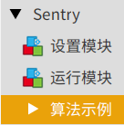

.. _chapter_mixly_index:

Sentry2-Mixly 开发文档
======================

Sentry-Mixly 库是一个专门为 Mixly 图形化编程打造的驱动库，适用于 Sentry 系列产品。

安装
----

1. `下载 <https://mixly.cn/explore/software>`_ 并安装Mixly，建议安装路径不要存在中文
2. 根据Mixly的版本号 `下载 <https://github.com/AITosee/Sentry-Mixly/releases>`_ 对应的Sentry的驱动库

   .. attention::
        - Sentry-Mixly-v2.x.x.zip                 适用于Mixly3.0以及Mixly2.0rc4
        - Sentry-Mixly-v2.x.x_mixly2.0rc3.zip     适用于Mixly2.0rc3
        - Sentry-Mixly-v2.x.x_mixly1.x.zip        适用于Mixly1.x

3. 打开Mixly，点击右上角 设置->管理库->导入库->本地导入，选择下载的驱动库压缩包
4. 左侧菜单栏出现Sentry视觉传感器，并且代码块均正常显示，则导入成功

例程
----

Mixly 例程在库的第三栏 ``算法示例``，点开即有每种算法调用的基础方法。

.. tip::

    亦可从 `网盘 <https://pan.baidu.com/s/1Ur39pkhnL8yznRqGbX2tkA?pwd=1022>`_ 下载例程:

    路径：资料下载->视觉传感器->Sentry2->出厂固件->例程

.. _sentry2_mixly_block_introduce:

模块介绍
--------

1. 初始化 Sentry

    本模块必须在 Sentry2 其余的模块之前调用

    .. image:: images/mixly_sentry_init.png

    - 参数 1：端口类型
    - 参数 2：Sentry 设备地址

2. 开启/关闭算法

     .. image:: images/mixly_sentry_vision_begin.png

     - 参数 1：启用/关闭算法
     - 参数 2：算法类型

     .. attention::

         满足限制条件时,Sentry2可以并行运行多种算法，详见： :doc:`../../Sentry2/Vision/index`

3. 获取算法检测到的结果数量

     .. image:: images/mixy_sentry_get_status.png

     - 参数 1：算法类型
     - 返回：算法检测到的结果数量

4. 获取结果信息

     获取对应算法各个识别结果的分类数据信息

     .. image:: images/mixly_sentry_get_value.png

     - 参数 1：算法类型
     - 参数 2：需要获取的值的类型
     - 参数 3：多个算法结果的 ID 号
     - 返回：对应类型算法检测到结果的值

     .. attention::

         - 二维码算法只能识别并返回一个二维码的数据信息
         - 因硬件资源限制，Arduino Nano 每次最多收到1个检测结果；Arduino UNO 每次最多收到5个检测结果
         - 需要先执行块 ``获取算法检测到的结果数量`` ，该模块相关信息才会被更新

5. 判定结果类别

     判定对应算法各个识别结果的类别

     .. image:: images/mixly_sentry_check_label.png

     - 参数 1：算法类型
     - 参数 2：对应的类别
     - 参数 3：多个算法结果的 ID 号
     - 返回： ``是`` 或者 ``否``

     .. attention::

         需要先执行块 ``获取算法检测到的结果数量`` ，该模块相关信息才会被更新

6. 设置白平衡

     设置Sentry2的白平衡模式，调用本代码块时其后需要添加0.5-1秒的延时

     .. image:: images/mixly_sentry_set_white_balance.png

     - 参数 1：白平衡模式

7. 设置参数组的数量

     .. image:: images/mixly_sentry_set_param_num.png

     - 参数 1：算法
     - 参数 2：参数组的数量

8. 设置颜色识别算法参数

     .. image:: images/mixly_sentry_color_set_param.png

     - 参数 1：识别区域中心点横坐标
     - 参数 2：识别区域中心点纵坐标
     - 参数 3：识别区域的宽度
     - 参数 4：识别区域的高度
     - 参数 5：本组参数的编号

9. 设置色块检测算法参数

     .. image:: images/mixly_sentry_blob_set_param.png

     - 参数 1：目标色块的最小宽度
     - 参数 2：目标色块的最小高度
     - 参数 3：目标色块的颜色
     - 参数 4：本组参数的编号

10. 设置通用算法参数

      各个参数的含义因算法不同而各异，详见： :doc:`../../Sentry2/Vision/index` 下各类算法算法的 ``配置参数``

      .. image:: images/mixly_sentry_set_param.png

      +----------+--------------------+--------------------+------------------+------------------+----------------------+
      | 算法名称 | 参数1              | 参数2              | 参数3            | 参数4            | 参数5                |
      +==========+====================+====================+==================+==================+======================+
      | 自定义   | 自定义             | 自定义             | 自定义           | 自定义           | 自定义               |
      +----------+--------------------+--------------------+------------------+------------------+----------------------+
      | 颜色识别 | 识别区域中心横坐标 | 识别区域中心纵坐标 | 识别区域宽度     | 识别区域高度     | 无                   |
      +----------+--------------------+--------------------+------------------+------------------+----------------------+
      | 色块检测 | 无                 | 无                 | 目标色块最小宽度 | 目标色块最小高度 | 目标色块颜色分类标签 |
      +----------+--------------------+--------------------+------------------+------------------+----------------------+
      | 人脸识别 | 无                 | 无                 | 无               | 无               | 存储或删除人脸数据   |
      +----------+--------------------+--------------------+------------------+------------------+----------------------+
      | 深度学习 | 无                 | 无                 | 无               | 无               | 存储或删除物体信息   |
      +----------+--------------------+--------------------+------------------+------------------+----------------------+
