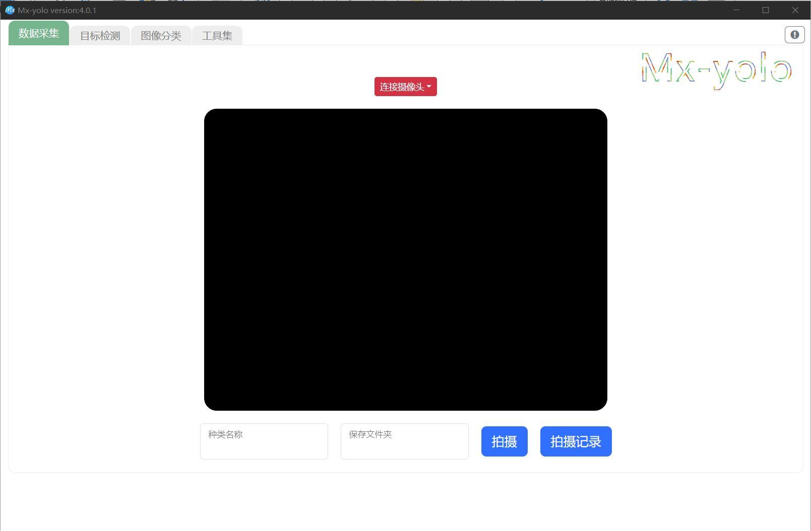

Sentry2MV 开发文档
==================

SentryMV（Sentry Micropython Vision）模式通过 MicroPython 编程语言对硬件进行编程，简称MV模式。
MicroPython 是业内十分知名的低资源需求 Python 脚本解释器，直接运行于嵌入式处理器内，
仅需通过串口向硬件设备传输 Python 脚本即可实现对其控制和逻辑处理，如读取摄像头，运行算法，
输出数据等，无需固件编译，简单易用。

Sentry2MV 是专为Sentry2视觉传感提供的可运行MV模式的固件，基于嘉楠科技 CanMV 开源固件而开发。
固件兼容 CanMV IDE 的接入和使用，CanMV是嘉楠科技提供的一款可视化的开发环境软件，用于编写 MicroPython
程序，代码上传，打印日志等操作，软件内置丰富的开源示例程序可供用户学习和使用。

基础接口可参考 `CanMV 官方文档 <https://developer.canaan-creative.com/canmv/main/canmv/index.html>`_ 。

Sentry2MV 固件下载与升级
+++++++++++++++++++++++

Sentry2 视觉传感器使用 SentryMV 模式需要烧录专用的固件，该固件根据Sentry2产品做了相
应的硬件适配，对CanMV中的模型算法也做了函数优化处理，调用更简单易懂。

固件下载
--------

在线下载：:ref:`Sentry2MV固件<chapter_download_firmware_sentry2mv_index>`   

网盘下载 `点击此处进入网盘 <https://pan.baidu.com/s/1Ur39pkhnL8yznRqGbX2tkA?pwd=1022>`_
或打开网盘地址(提取码：1022)：https://pan.baidu.com/s/1Ur39pkhnL8yznRqGbX2tkA?pwd=1022

网盘位置 ``资料下载/视觉传感器/Sentry2/Sentry2MV固件``， 下载相应的 sentry2mv 固件，分为消费版和企业版固件

- 企业版：vs_sentry2mv_k210_vX_X_X_XXXXXXXX_enterprise_e.kfpkg
- 消费版：vs_sentry2mv_k210_vX_X_X_XXXXXXXX_consumer_e.kfpkg

*提示：SentryMV是一系列 MV 模式的总称，Sentry2MV 是专为Sentry2产品开发的运行MV模式的专用固件，不适用于其他Sentry系列的产品*

*提示：上电后查看 Sentry2 屏幕运行界面右下方的字母标识，显示字母“E”或“S”则为企业版，字
母“C”则为消费版*

*注意：使用 Sentry2MV 固件后，Sentry2 的标准固件功能将无法使用，如果要切换回标准模式，需
要重新烧录标准版的固件。*

固件升级
--------

请参考固件升级教程：https://tosee.readthedocs.io/zh/latest/Sentry2/Upgrade/index.html

固件运行
--------

新固件上电后会显示如下的开机画面：

CanMV IDE 软件下载与安装
++++++++++++++++++++++++

软件下载
--------

CanMV IDE 版本为 V2.9.2，可以直接从 Github 上下载：https://github.com/kendryte/canmv_ide/releases/download/v2.9.2-2/canmv-ide-windows-2.9.2-v2.9.2-2-0-g132467a.exe
或从网盘中下载：
网盘位置 ``资料下载/视觉传感器/Sentry2/Sentry2MV 固件/CanMV IDE``

软件安装
--------

打开安装包后根据提示进行安装，如遇问题，可以参考官方在线文档：
https://developer.canaan-creative.com/canmv/main/canmv/get-start/quick-start.html#canmv-ide

功能界面介绍
------------

    .. image:: images/sentry2mv_canmv_ide_description.png

    区域①菜单栏：操作文件，使用工具等。

    区域②快捷按钮：区域①中的 **文件** 和 **编辑** 中部分功能的快捷方式。

    区域③连接设备：连接设备和程序控制按钮。

    区域④代码编辑区：编辑要运行的代码。

    区域⑤串行终端：显示串口打印的调试信息。

    区域⑥图像预览：显示摄像头的图像预览。

    区域⑦固件信息：显示连接的串口号以及固件的相关信息。

设备连接
--------

- 将 Sentry2 通过 TypeC 数据线连接到电脑USB口, 然后点击CanMV IDE左下角连接按钮

    .. image:: images/sentry2mv_canmv_ide_connection.png

- 弹出选择串口，选择 Sentry2 对应的串口号，如果有多个串口请先确定对应的串口号再点击OK打开

    .. image:: images/sentry2mv_canmv_ide_choose_port.png

- 连接成功会将图标变为已连接状态，同时灰色播放键变为绿色

    .. image:: images/sentry2mv_canmv_ide_connected.png

SentryMV 使用指导
+++++++++++++++++

TF 卡导入模型
-------------

SentryMV 运行神经网络类型的算法，首先需要将算法模型按照固定的路径存储在 TF 卡中。

1. 准备一张 micro TF 卡（即 TF 卡），嘉楠 K210 芯片只能加载 SPI 信号的 TF 卡，所以部分 TF 卡无法被识别，
   具体情况可查看嘉楠科技对 TF 卡的解释与说明：https://developer.canaan-creative.com/canmv/main/canmv/faq.html#TF-micro-TF
2. 将 TF 卡格式化为 FAT32 格式，格式化会删除 TF 卡内所有的数据文件，请务必提前做好备份
3. 从网盘中下载算法模型： ``资料下载/视觉传感器/Sentry2/Sentry2MV 固件/算法模型文件``
4. 将算法模型解压后，连同“KPU”文件夹一起导入 TF 卡中，不要修改路径，算法模型保存的路径形式为：
   /KPU/yolo_face_detect/face_detect_320x240.kmodel
5. 拆开 Sentry2 的外壳，并将 TF 插入卡座中，TF 卡的金手指朝下。

*提示：新推出可外接 TF 卡的 Sentry2 外壳，可免去拆除外壳的步骤*

通过串口助手查看信息
--------------------

1. 将 Sentry2 通过 USB-C 连接至电脑并打开串口助手（需要支持中文字符，比如
   Arduino 中自带的串口调试器），设置波特率为 115200，数据位 8,停止位 1,无校验。
2. 打开 Sentry2 对应的串口，此时可以看到有开机信息输出。如果没有自动打印开机日志，
   可以手动按一下 Sentry2 的 Reset 按键输出日志中如果有 ``TF card has mounted`` 字样（下图所示），
   表示 TF 卡可以被识别

   .. image:: images/sentry2mv_TF_card_mounted.png

3. 在串口助手中分别发送以下指令查看 TF 卡数据，发送指令时需要发送换行符号

   .. code-block:: python
       :linenos:

       import os
       os.listdir("/TF")
       os.listdir("/TF/KPU")

   看到 ``KPU`` 等字样则表明 TF 卡的数据是可以被读写的

   .. image:: images/sentry2mv_TF_readable.png

运行官方示例程序
----------------

CanMV IDE 内置丰富的示例程序，包括对硬件接口的操作、对图像的处理、寻找边缘
特征、绘制图像、输出文字、识别形状、识别条码、识别颜色、识别人脸等，可以查看在线
用户手册进行学习和使用：https://developer.canaan-creative.com/canmv/main/canmv/demo/index.html

sentry.py 函数库
----------------

Sentry2MV 固件内置了 sentry.py 函数库，提供了几个常用的函数，并对部分 KPU 神
经网络类型的算法采用了统一的函数接口，相比于自带的示例程序而言，代码变的更简洁明
了，易于理解，从而可以更好的专注于应用程序的开发。

sentry.py 支持的算法列表：

- 人脸属性检测 - FaceAttributeDetect
- 人脸 68 关键点检测 - FaceDetectWith68landMark
- 人脸口罩检测 - FaceMaskDetect
- 头部检测 - HeadDetect
- 身体检测 - BodyDetect
- 车牌识别 - LicenseplateRecognize
- 手写数字识别 - MnistNumber
- 常见 20 类物体检测 - Voc20ObjectDetect
- 人脸检测 - YoloFaceDetect
- 手部检测 - YoloHandDetect
- 自训练检测模型 - MyDetector
- 自训练分类模型 - MyClassifier

通过串口助手发送下面的指令查看 sentry.py 的帮助文档：

    .. code-block:: python
        :linenos:

        import sentry
        sentry.help()

运行人脸属性检测算法示例程序
----------------------------

通过该程序可以了解 sentry.py 算法调用的标准流程。主要分为硬件初始化、算法初始
化、运行算法、绘制结果、屏幕显示几个步骤

人脸属性检测算法-FaceAttributeDetect 可以检测到人脸方位、大小，人脸 5 个关键
点位（眼睛、鼻子、嘴角），以及性别，是否张嘴，是否微笑，是否戴眼镜的属性信息。操
作步骤如下：

1. 在 CanMV IDE 中新建一个项目，并复制以下代码。也可以从 sentry.help()的
   帮助信息中复制代码：

   .. code-block:: python
    :linenos:

    import sensor,time,lcd,sentry

    sentry.init() # 初始化硬件
    vision = sentry.FaceAttributeDetect() # 可更换其他算法，参考算法列表
    vision.init() # 初始化算法
    clock = time.clock() # 初始化计时器，用于统计帧率，可不调用
    while(True):
        clock.tick() # 更新计时器
        img = sensor.snapshot() # 获取图片
        boxes, landmarks, labels = vision.process(img) # 运行算法
        sentry.draw(img, boxes, landmarks, labels) # 在图片上绘制检测结果
        lcd.display(img) # 显示图片
        fps = clock.fps() # 获取帧率
        print("%2.1ffps"%fps) # 在控制台中显示帧率
    vision.deinit() # 退出算法

2. 连接 Sentry2 设备
3. 点击运行程序按钮
4. 检测人脸并在 Sentry2 的屏幕上观察检测结果

   .. image:: images/sentry2mv_face_result.jpg
    :width: 300

   *提示：必要时可以关闭掉 CanMV IDE 中右上角的“图传功能”以获得更流畅的体验*

5. 当要停止程序运行时，需要点击 CanMV IDE 左下角结束按钮

   .. image:: images/sentry2mv_stop.png

   *注意：程序停止后会释放资源，这样才能继续运行下一个程序，否则会出现内存不足等错误提示。*

   *注意：如果没有释放资源，则需要断开连接并重启设备后再运行新的代码开发环境搭建*

运行车牌识别算法程序
--------------------

该程序用于介绍如何调用 Sentry2 的 PH2.0 端口，并将识别结果进行输出
车牌识别算法-LicenseplateRecognize 可以进行离线车牌识别，其中车牌的省份用拼
音标注

1. 该例程可以将识别到的车牌信息通过 Sentry2 的 PH2.0 数据口对外传输，传输
   方式为 UART 模式，115200 波特率。

   测试的电路如下图所示，Sentry2 的 USB-C 口作为程序的调试端口，Sentry2 的 PH2.0
   端口作为数据输出端口，通过一块 USB 转串口模块连接至电脑，电脑端通过串口调试助手
   读取数据，用户也可以直接将 PH2.0 端口连接主控板

   .. image:: images/sentry2mv_connect2pc.png

   *注意：当使用 USB-C 口供电时，请断开 PH2.0 数据口的供电，图中红色线，避免电流倒灌损坏器件。*

2. 更改内部 gc heap 内存大小，因为该示例程序模型文件比较大，需要将 gc heap
   内存设为 650KB 的大小才能正常运行。使用下面的代码进行设置，或在网盘中找到
   ``demo_set_gc_heap_size.py`` 文件：

   .. image:: images/sentry2mv_set_gc_heap.jpg

   *注意：运行其他算法时，需要将 gc heap 设置为 1024KB 的大小*

3. 加载示例程序
   在网盘中找到示例程序并在 CanMV IDE 中打开： ``资料下载/视觉传感器
   /Sentry2/Sentry2MV 固件/应用例程``

   .. image:: images/sentry2mv_examples.png

4. 将 Sentry2 对准车牌并观察输出结果

   .. image:: images/sentry2mv_licenseplate_result.jpg

算法开机自启动
--------------

SentryMV 开机后会加载并自动运行 main.py 脚本，用户可以将自己的程序存放在这
个 main.py 中从而实现算法开机自启动，有 2 个方法可以实现：

- 方法 1（推荐）：将所需要运行的.py 文件重命名为 main.py，并将其拷贝至 TF 卡的
  根目录中实现开机自启动
- 方法 2：在 CanMV IDE 的 ``工具菜单`` 中，将当前打开的.py 文件直接烧录到 Sentry2
  的 flash 中，如下图箭头所示：

  .. image:: images/sentry2mv_code_download.png

*注意：如果通过方法 2 向 flash 中写入的 main.py 代码有问题且无法再通过方法 2 进行改写，则可以
将修改该后的.py 脚本并命名为“cover.main.py”存放到 TF 卡中，SentryMV 启动后会将该脚本替换到
flash 中，启动正常后从 TF 卡中删除该文件即可*

*注意：请不要覆盖掉 flash 中的 boot.py 脚本*

用户模型训练
++++++++++++

SentryMV 支持导入用户自行训练的模型文件，本章节将通过第三方 K210 模型训练软
件 Mx-yolo 来讲解如何训练算法模型。该软件集成度高，使用简单方便，支持 ``目标检测``
和 ``图像分类`` 两种模型的训练，两者的训练和使用流程略有差异，如下所示：

官方提供了分别印有自行车、摩托车以及小汽车3张卡片的照片、对应的标注文件以及训练好的目标分类模型，供用户快速体验。

网盘位置： ``资料下载/视觉传感器/Sentry2/Sentry2MV固件/算法模型自训练``

软件安装
--------

进入网盘并下载安装程序 Mx-yolo-setup_V4.0.exe，双击运行并根据提示进行安装
网盘位置：``资料下载/视觉传感器/Sentry2/Sentry2MV 固件/算法模型自训练``
`点击网盘下载 Mx-yolo-setup_V4.0.exe <https://pan.baidu.com/s/1Ur39pkhnL8yznRqGbX2tkA?pwd=1022>`_

*注意：安装路径中不能包含中文字符*

*注意：该软件需要 3G 的硬盘空间，请确保所选择的安装盘符有足够的剩余空间
安装好后双击打开 Mx-yolo.exe 即可运行该软件*

图片数据采集
------------

图片数据集是模型训练的基础，图片采集的数量和质量将会对模型效果起到至关重要的
作用。要训练一个较好的算法模型通常需要一万张甚至数十万张以上的图片数据，涵盖多种
不同环境和角度的图片数据。对于教学而言，单个物体 100 张左右的图片数据一样可以满
足训练需求，建议不少于 300 张有效图片。

图片数据可以来自于网上的开源数据集，对于特殊物体则需要自行拍摄。Mx-yolo 自
带“图片采集”功能，可以通过调用电脑上的摄像头进行图片采集。

但为了取得更好的识别效果，我们推荐使用 sentry2 进行拍摄，这样得到的原始数据
与硬件最为吻合。可以从网盘上下载拍摄脚本 sentrymv_auto_capture_picture.py，该脚
本可以实现连续拍摄图片并保存至 TF 卡中

网盘地址： ``资料下载/视觉传感器/Sentry2/Sentry2MV 固件/应用例程/拍照并保
存至 TF 卡例程``

通过 CanMV IDE 加载该文件并运行，程序运行后左上角会显示“paused”字样，垂
直压按摇杆可以启动拍照功能，将每隔 200ms 拍摄一张图片，再次压按摇杆将会停止拍照。

为了适配 Mx-yolo 的规定，拍摄的图片会被压缩剪裁至 224x224 分辨率后按照
image_xxx.jpg 的格式命名保存在 TF 卡的“image”文件夹中。图片名中的 xxx 为图片编
号，从 0 开始顺序增加，拍摄完的数据请及时拷贝到电脑端，避免丢失或被覆盖

为了取得较好的识别效果，首先应当在实际的使用场景内或者接近的场景内采集数据，
降低由背景与光照差异引起的不利影响，其次应当从不同距离不同角度充分采集数据

图片数据整理
------------

首先需要对所采集的图片进行筛选，删除以下几类图片：

- 无关图片
- 目标物体模糊
- 目标物体不完整
- 目标物体过小

遍历结束后，如果认为某个或者某些角度下的图片数量不足，请补采集数据

对于“目标检测”算法，所有图片存放于同一个 images 文件夹内即可

对于“图像分类”算法，所拍摄图片需要按类别分别存放于不同的文件夹内，例如垃圾
分类的图片数据：

图片数据标注
------------

训练“目标检测”模型之前需要对每一张图片进行标注处理，标注是指在原始图片中标
记出目标物体并分配一个分类标签，最后生成一系列的标注文档用于训练。

在工作目录下新建两个文件夹：images 和 labels。将所有训练图片数据拷贝至 images
文件夹内

在 Mx-yolo 的界面中选择“工具集”标签页，点击“打开图片标注助手”按钮，将会
打开图片标注工具：

按图片中所示步骤进行图片数据标注：

*注意：加载的图片和标签路径中不能包含中文字符*

目标检测模型训练
----------------

训练“目标检测”模型步骤如下：

1. 在 Mx-yolo 上方标签栏中选择 ``目标检测`` 页面；
2. 选择图片文件夹地址，不可包含中文字符
3. 选择标签文件夹地址，不可包含中文字符
4. 配置训练参数：软件提供了 4 个参数可以配置。其中 ``训练次数`` 越大，模型
   训练所需的时间也就越长，模型效果也会有所改善且越趋于稳定。 ``Alpha``
   值决定了输出模型的大小，当硬件内存不足导致加载模型失败时，可以减小该
   值，但识别效果可能会有所降低，一般取 0.75 或 0.5 即可。 ``Batch Size`` 和
   ``数据增强`` 保持默认值即可，一般不建议改变
5. 点击 ``开始训练``
6. 查看训练过程数据和日志，如果训练出现问题，需要点击右上角 ``停止训练``
   按钮，然后再重新 ``开始训练``。一般常见的问题为训练图片与标签数据不对
   应，或者图片尺寸有问题等。
7. 训练结束后会弹出 ``训练完成`` 对话框
8. 可以在右侧上方查看 ``训练记录``，查看训练效果是否满足需求

图像分类模型训练
----------------

训练 ``图像分类`` 模型步骤与 ``目标检测`` 操作步骤基本一致，只是不需要加载 ``标签
文件夹地址``，可以参考图片中的步骤进行操作：

*注意：加载的图片路径中不能包含中文字符*

查看模型文件
------------

``目标检测`` 模型训练结束后，所生成的模型文件会存放于：
Mx-yolo/out/yolo_xxxx-xx-xx_xx-xx-xx/result_root_dir/detector_result

``图像分类`` 模型训练结束后，所生成的模型文件会存放于：
Mx-yolo/out/classifier_xxxx-xx-xx_xx-xx-xx/result_root_dir/detector_result

文件夹里包含以下文件：

调用自训练模型
--------------

用户自训练模型可以在 CanMV 软件中，参考上章节的 boot.py 脚本来运行算法，但
一般来说需要做一些代码修改该和算法后处理操作才能稳定运行起来，适合有经验的工程师。

SentryMV 为了方便用户调用自训练的算法模型，在 sentry.py 中提供了两个通用算法
类，只需将算法模型相关的文件拷贝至 TF 卡中即可方便的运行算法：

- 目标检测 - MyDetector 算法类
- 图像分类 - MyClassifier 算法类

算法调用步骤：

1. 将模型及其相关文件存入 TF 卡中：调用 ``目标检测`` 算法需要准备 3 个文件
   mx.kmodel，labels.txt 和 anchor.txt，存放于 TF 卡的“/TF/KPU/my_detector”
   地址。 ``图像分类`` 只需要 mx.kmodel，labels.txt 两个文件，存放于 TF 卡
   的“/TF/KPU/my_classifier”地址。

   其中 mx.kmodel 和 labels.txt 为 5.7 章节中模型训练后生成的文件，直接复制
   和替换掉原有文件即可。

   目标检测算法所需文件:

   .. image:: images/mx-yolo_train_model_1.png

   图像分类算法所需文件:

   .. image:: images/mx-yolo_train_model_2.png

2. ``目标检测`` 算法所需的 anchor.txt 为算法初始化时的参数，可以从 5.7 章节
   的 boot.py 中获取到，可以按下图所示步骤操作：

   .. image:: images/mx-yolo_train_model_3.png

3. 打开 CanMV，修改 4.5 章节人脸模型调用示例中的算法类型，并运行算法即可

   目标检测：vision = sentry.MyDetector()

   图像分类：vision = sentry.MyClassifier()

硬件内置函数
++++++++++++

本章节对 sentry.py 的内置函数做一些简介，并给出一些示例代码

硬件相关函数
------------

+-------------------------------------------+---------------------------------------------------------+
| 函数名                                    | 简介                                                    |
+===========================================+=========================================================+
| help()                                    | 打印帮助文档                                            |
+-------------------------------------------+---------------------------------------------------------+
|| UART(baudrate=115200)                    || 初始化通讯端口为 UART 模式，可修改波特率，其余参数     |
||                                          || 为：数据位 8,停止位 1,校验无                           |
+-------------------------------------------+---------------------------------------------------------+
| I2C(freq=100000)                          | 初始化 PH 通讯端口为 I2C 模式，可修改该时钟频率         |
+-------------------------------------------+---------------------------------------------------------+
| UpKey(irq_handle=None)                    | 初始化摇杆按键上，可添加中断函数                        |
+-------------------------------------------+---------------------------------------------------------+
| DownKey(irq_handle=None)                  | 初始化摇杆按键下，可添加中断函数                        |
+-------------------------------------------+---------------------------------------------------------+
| LeftKey(irq_handle=None)                  | 初始化摇杆按键左，可添加中断函数                        |
+-------------------------------------------+---------------------------------------------------------+
| RightKey(irq_handle=None)                 | 初始化摇杆按键右，可添加中断函数                        |
+-------------------------------------------+---------------------------------------------------------+
| EnterKey(irq_handle=None)                 | 初始化摇杆按键中，可添加中断函数                        |
+-------------------------------------------+---------------------------------------------------------+
| Led()                                     | 初始化 RGB LED，基于 ws2812 驱动，总共有 2 颗           |
+-------------------------------------------+---------------------------------------------------------+
| LedHeart()                                | 初始化心跳指示灯，基于 GPIO 控制                        |
+-------------------------------------------+---------------------------------------------------------+
|| init(sensor_pixformat=sensor.RGB565,     || 初始化摄像头和屏幕等硬件，默认采用 320x240 的 QVGA     |
|| sensor_framesize=sensor.QVGA,            || 分辨率，如果不使用内置函数，则无需加载，直接用 CanMV   |
|| sensor_skip_frames=2000)                 || 示例中的 sensor 调用方法即可                           |
+-------------------------------------------+---------------------------------------------------------+
|| draw(img,                                || 在图片 img 上绘制检测结果，包括识别框 boxes，关键点    |
|| boxes, landmarks,                        || 标签名称 labels                                        |
|| landmarks=None,                          || color_xxx：可以修改颜色                                |
|| labels=None,                             || label_scale：可以缩放字体                              |
|| color_boxes=(0, 255, 0),                 || fullscreen：是配合 sentry.display 函数使用的，详见该函 |
|| color_landmarks=(0, 0, 255),             || 数的介绍                                               |
|| color_labels=(0, 255, 255),              ||                                                        |
|| label_scale=2,                           ||                                                        |
|| fullscreen=True)                         ||                                                        |
+-------------------------------------------+---------------------------------------------------------+
|| display(img, top_string = "", bot_string || sentry.py 内置的屏幕显示函数，可以显示一些文字和图片   |
|| = "", fullscreen = True)                 || 缩放，但于某些算法运行时会遇到内存不足的问题，请使     |
||                                          || 用 CanMV 自带的 lcd.display 函数                       |
||                                          || top_string：屏幕上方添加待显示的字符串                 |
||                                          || bot_string：屏幕下方添加待显示的字符串                 |
||                                          || fullscreen：决定图片是否全屏显示，为 True 时，将全屏   |
||                                          || 显示图片，但只会从 320x240 的图片中截取中间 240x240    |
||                                          || 的区域进行显示，帧率高，内存少。为 False 时，会将      |
||                                          || 320x240 的图片压缩至 240x180 进行显示，可以显示完      |
||                                          || 整的摄像头画面。无论屏幕如何设置，均不影响 6.6 节例    |
||                                          || 程中输出结果的坐标值，算法会将坐标值按照 320*240       |
||                                          || 分辨率进行换算并输出。                                 |
+-------------------------------------------+---------------------------------------------------------+

算法相关函数
------------

+----------------------------------------+-------------------------------------------------------+
| 函数名                                 | 简介                                                  |
+========================================+=======================================================+
|| init(...)                             || 算法初始化，加载模型和参数，参数全部采用默认值，需   |
||                                       || 要将所有的模型存放在 TF 卡中的指定位置，否则无法加载 |
+----------------------------------------+-------------------------------------------------------+
|| boxes,landmarks,labels = process(img) || 运行算法并返回结果，boxes（物体中心点坐标、大小框，  |
||                                       || 分类标签 id 值，检测得分），landmarks（关键点或中心  |
||                                       || 点），labels（分类标签字符串）                       |
+----------------------------------------+-------------------------------------------------------+
| deinit()                               | 退出算法，释放资源                                    |
+----------------------------------------+-------------------------------------------------------+

自训练检测算法初始化函数
------------------------

+------------------------------------------------+-----------------------------------+
| 函数名                                         | 简介                              |
+================================================+===================================+
|| init(self,                                    || 算法初始化有默认参数，必要时可以 |
|| model_path="/TF/KPU/my_detector/mx.kmodel",   || 修改其参数                       |
|| label_path="/TF/KPU/my_detector/labels.txt",  || 仅适合专业工程师使用             |
|| anchor_path="/TF/KPU/my_detector/anchor.txt", || threshold：只有检测得分不低于该  |
|| img_w=224,                                    || 值，算法才会输出本次检测结果；合 |
|| img_h=224,                                    || 理设置该值，可以有效防止误识别。 |
|| net_w=224,                                    || 非必要，请勿修改默认值           |
|| net_h=224,                                    || nms_value：屏幕中同一个物体显示  |
|| layer_w=7,                                    || 有多个识别框时，降低此值，能够有 |
|| layer_h=7,                                    || 效过滤重复识别。非必要，请勿修改 |
|| threshold=0.7,                                || 默认值                           |
|| nms_value=0.3,                                ||                                  |
|| classes=1)                                    ||                                  |
+------------------------------------------------+-----------------------------------+

自训练分类算法初始化函数
------------------------

+-------------------------------------------------+-----------------------------------+
| 函数名                                          | 简介                              |
+=================================================+===================================+
|| init(self,                                     || 算法初始化有默认参数，必要时可以 |
|| model_path="/TF/KPU/my_classifier/mx.kmodel",  || 修改其参数                       |
|| label_path="/TF/KPU/my_classifier/labels.txt", || 仅适合专业工程师使用             |
|| net_w=224,                                     || threshold：只有检测得分不低于该  |
|| net_h=224,                                     || 值，算法才会输出本次检测结果；合 |
|| threshold=0.7)                                 || 理设置该值，可以有效防止误识别。 |
||                                                || 非必要，请勿修改默认值           |
+-------------------------------------------------+-----------------------------------+

硬件调用示例程序
----------------

.. code-block:: python
    :linenos:

    import sentry,time
    # 右按键中断函数
    def irq_right_key(pin_num):
        led.set_led(0,(10,0,0)) # 设置Led0的颜色，R=10,G=0,B=0，即红色
        led.set_led(1,(0,0,0)) # 设置Led1的颜色，R=0,G=0,B=0，即关闭
        led.display() # 显示颜色
    # 左按键中断函数
    def irq_left_key(pin_num):
        led.set_led(0,(0,0,0))
        led.set_led(1,(0,10,0))
        led.display()

    uart = sentry.UART(115200) # 初始化PH2.0的串口
    led = sentry.Led() # 初始化2颗RGB LED
    right_key = sentry.RightKey(irq_right_key) # 初始化右按键
    left_key = sentry.LeftKey(irq_left_key) # 初始化左按键
    heart = sentry.LedHeart() # 初始化心跳指示灯

    while(True):
        uart.write("hello world") # 串口打印
        heart.value(1) # 心跳灯亮起
        time.sleep_ms(300) # 延时300ms
        heart.value(0) # 心跳灯关闭
        time.sleep_ms(200)

算法结果输出示例
----------------

.. code-block:: python
    :linenos:

    import sensor,time,lcd,sentry

    sentry.init() # 初始化硬件
    vision = sentry.FaceAttributeDetect() # 可更换其他算法，参考算法列表
    vision.init() # 初始化算法
    uart = sentry.UART(115200) # 初始化通讯端口为UART模式

    while(True):
        img = sensor.snapshot() # 获取图片
        boxes, landmarks, labels = vision.process(img) # 运行算法
        sentry.draw(img, boxes, landmarks, labels) # 在图片上绘制检测结果
        lcd.display(img) # 显示图片

        # 如果要在终端中显示数据，可以将以下 uart.write 替换为 print
        # boxes 数据结构：
        # [[x1,y1,w1,h1,l1,s1],[x2,y2,w2,h2,l2,s2],...]
        for b in boxes:
            uart.write('x=%d'%b[0]) # 输出中心点水平坐标x
            uart.write('y=%d'%b[1]) # 输出中心点垂直坐标y
            uart.write('w=%d'%b[2]) # 输出物体宽度w
            uart.write('h=%d'%b[3]) # 输出物体高度h
            uart.write('l=%d'%b[4]) # 输出物体分类标签号l
            uart.write('s=%f'%b[5]) # 输出物体检测得分s，小数值

        # landmarks 数据结构：
        # [[(x11,y11),(x12,y12),...],[(x21,y21),(x22,y22),...]],...]
        for lm in landmarks:
            for m in lm:  # 遍历所有关键点
                uart.write('lmx=%d'%m[0]) # 输出关键点坐标x
                uart.write('lmy=%d'%m[1]) # 输出关键点坐标y

        # labels 数据结构：
        # [['label11','label12',...],['label21','label22',...],...]
        for lb in labels:
            for l in lb:  # 遍历所有标签
                uart.write('label=%s'%l)  # 输出标签字符串

    vision.deinit() # 退出算法

.. Sentry2MV 库下载到设备
.. ----------------------

.. - 下载 Sentry2MV github 工程：https://codeload.github.com/AITosee/Sentry2MV/zip/refs/heads/main
.. - 解压下载上一步的下载的 ``.zip`` 文件
.. - 将 Sentry2 上的 SD 卡连接至电脑，并将解压得到的相关文件中的 ``KPU/`` 文件夹和 ``sentry.py`` 拷贝到 SD 卡上
.. - 弹出 SD 卡，并将 SD 卡插回 Sentry2

.. 安装 CanMV IDE
.. ---------------

.. 软件下载
.. ::::::::

.. - 官网下载：https://canaan-creative.com/developer

..     .. image:: images/sentry2mv_canmv_ide_download.jpg

.. - github 下载：https://github.com/kendryte/canmv_ide/releases

..     .. image:: images/sentry2mv_canmv_ide_download_from_github.jpg

.. 软件安装
.. ::::::::

.. - 下载后得到canmv-ide-windows-vx.x.x-gxxxxxx.exe文件，双击打开安装包，按照提示进行安装

..     .. image:: images/sentry2mv_canmv_ide_install.jpg

.. 功能界面介绍
.. ::::::::::::

..     .. image:: images/sentry2mv_canmv_ide_description.png

..     区域①菜单栏：操作文件，使用工具等。

..     区域②快捷按钮：区域①中的 **文件** 和 **编辑** 中部分功能的快捷方式。

..     区域③连接设备：连接设备和程序控制按钮。

..     区域④代码编辑区：编辑要运行的代码。

..     区域⑤串行终端：显示串口打印的调试信息。

..     区域⑥图像预览：显示摄像头的图像预览。

..     区域⑦固件信息：显示连接的串口号以及固件的相关信息。

.. 设备连接
.. ::::::::

.. - 将 Sentry2 通过 TypeC 数据线连接到电脑USB口, 然后点击CanMV IDE左下角连接按钮

..     .. image:: images/sentry2mv_canmv_ide_connection.png

.. - 弹出选择串口，选择 Sentry2 对应的串口号，如果有多个串口请先确定对应的串口号再点击OK打开

..     .. image:: images/sentry2mv_canmv_ide_choose_port.png

.. - 连接成功会将图标变为已连接状态，同时灰色播放键变为绿色

..     .. image:: images/sentry2mv_canmv_ide_connected.png

.. 运行例程
.. ::::::::

.. - `下载 <https://github.com/AITosee/Sentry2MV/tree/main/examples>`_ Sentry2MV 的相关例程。
.. - 点击绿色的播放键运行程序

..     .. image:: images/sentry2mv_canmv_ide_download_example.png

.. - 绿色播放键图标变成红色停止键，点击一下可以停止运行的程序

..     .. image:: images/sentry2mv_canmv_ide_stop_code.png

.. 快速上手
.. ++++++++

.. - Sentry2 I2C 初始化

.. .. code-block:: python
..     :linenos:

..     import sentry

..     i2c = sentry.I2C(I2C.I2C0, freq=100000)
..     devices = i2c.scan()
..     print(devices)

.. - Sentry2 UART 初始化

.. .. code-block:: python
..     :linenos:

..     import sentry

..     uart = sentry.UART(115200, 8, 1, 0, timeout=1000, read_buf_len=4096)

.. - Yolov2 通用检测

.. .. code-block:: python
..     :linenos:

..     import sentry
..     import sensor, image, time, lcd
..     import gc

..     lcd.init()
..     sensor.reset()  # Reset and initialize the sensor. It will
..                     # run automatically, call sensor.run(0) to stop
..     sensor.set_pixformat(sensor.RGB565)  # Set pixel format to RGB565 (or GRAYSCALE)
..     sensor.set_framesize(sensor.QVGA)  # Set frame size to QVGA (320x240)
..     sensor.skip_frames(time=1000)  # Wait for settings take effect.
..     clock = time.clock()  # Create a clock object to track the FPS.

..     # 填写类别名称，anchor，模型地址，类别等参数
..     obj_name = ("face", )
..     anchor = (0.893, 1.463, 0.245, 0.389, 1.55, 2.58, 0.375, 0.594, 3.099,
..               5.038, 0.057, 0.090, 0.567, 0.904, 0.101, 0.160, 0.159, 0.255)
..     model_path = "/sd/KPU/yolo_face_detect/yolo_face_detect.kmodel"
..     classes = 1
..     # 实例化 sentry2 Yolov2 检测器
..     detector = sentry.Yolov2Detector()
..     detector.init(model_path,
..                   anchor,
..                   img_w=320,
..                   img_h=240,
..                   net_w=320,
..                   net_h=256,
..                   classes=classes)

..     while True:
..         # 循环读图、处理图片，并打印结果
..         clock.tick()  # Update the FPS clock.
..         img = sensor.snapshot()
..         dect = detector.process(img)
..         fps = clock.fps()
..         if len(dect) > 0:
..             print("dect:", dect)
..             for l in dect:
..                 img.draw_rectangle(l[0], l[1], l[2], l[3], color=(0, 255, 0))
..                 img.draw_string(l[0],
..                                 l[1] - 24,
..                                 obj_name[l[4]],
..                                 color=(0, 255, 0),
..                                 scale=2)

..         a = img.draw_string(0,
..                             0,
..                             "%2.1ffps" % (fps),
..                             color=(255, 255, 0),
..                             scale=2.0)
..         lcd.display(img)
..         gc.collect()
..     # 程序结束后释放检测器
..     detector.deinit()
